# 知识图谱驱动的真实攻击路径研判报告

生成时间：2026-06-14 02:46:49 UTC

## 风险摘要

- 综合风险评分：100 / 100
- 风险等级：critical
- 打开风险：14 项，其中严重风险 7 项
- 图谱节点：199 个
- 图谱关系：174 条
- 统一资产：143 个
- 证据片段：145 条
- 运行期日志事件：5 条
- 已识别攻击路径：3 条
- 可行动攻击路径：3 条
- 高度可信真实路径：1 条
- 平均路径置信度：68%
- 路径判定分布：likely-real-attack-path=1, provenance-risk-path=2
- 参考模型：GUAC 软件树/证据树可达性、OpenCTI observable 关系与置信度、NetworkX 路径评分、in-toto/SLSA 可信证据链、BloodHound 式入口到目标路径呈现

## 路径判定

本报告不再只列“发现了哪些漏洞”，而是判断这些证据能否串成一次真实攻击路径。

## 攻击路径

### 1. 证据可串成供应链投毒到运行期异常的攻击路径

一句话结论：能串成一次高度可信的真实攻击路径：入口、构建、产物、运行期行为连续可达，综合置信度 85%。

```mermaid
flowchart LR
  N1["CodeFile: cases/3cx-supply-chain/sample-repo/.github/workflows/desktop-release.y"]
  N2["DependencyPackage: npm:axios@1.6.8"]
  N3["CIStep: 运行期证据关联"]
  N4["BuildArtifact: 3cx-desktop-app.tar.gz"]
  N5["RuntimeService: 3CX X_TRADER replay runtime"]
  N6["LogEvent: 45.83.64.12"]
  N7["AttackStage: 供应链投毒阶段"]
  N1 -->|声明依赖入口| N2
  N2 -->|可进入构建| N3
  N3 -->|生成产物| N4
  N4 -->|deployed as| N5
  N5 -->|产生日志| N6
  N6 -->|关联| N7
```

- 路径判定：likely-real-attack-path
- 综合置信度：85%
- 严重级别：critical
- 路径评分：100 / 100
- 影响资产：cases/3cx-supply-chain/sample-repo/.github/workflows/desktop-release.yml -> npm:axios@1.6.8 -> 运行期证据关联 -> 3cx-desktop-app.tar.gz -> 3CX X_TRADER replay runtime -> 45.83.64.12
- 修复优先级：P0
- 攻击映射：T1195
- 参考模型：GUAC, SLSA, in-toto, BloodHound CE, MITRE ATT&CK STIX

路径步骤：
- cases/3cx-supply-chain/sample-repo/.github/workflows/desktop-release.yml --声明依赖入口--> npm:axios@1.6.8（GUAC，置信度 62%）：If the package is malicious or vulnerable, it can be selected during dependency resolution.
- npm:axios@1.6.8 --可进入构建--> 运行期证据关联（GUAC，置信度 72%）：A poisoned dependency can run install-time behavior or influence generated artifacts.
- 运行期证据关联 --生成产物--> 3cx-desktop-app.tar.gz（SLSA/in-toto，置信度 78%）：A compromised step or builder can produce a modified artifact.
- 3cx-desktop-app.tar.gz --deployed as--> 3CX X_TRADER replay runtime（Runtime deployment，置信度 82%）：Workspace runtime metadata links the verified artifact to the deployed service.
- 3CX X_TRADER replay runtime --产生日志--> 45.83.64.12（Runtime evidence，置信度 84%）：Runtime logs show whether the build-time risk manifested after deployment.
- 45.83.64.12 --关联--> 供应链投毒阶段（evidence，置信度 50%）：NormalizedLogEvent

可信证据链：
- GUAC：软件树中存在可达依赖节点；主体=npm:axios@1.6.8；状态=observed
- in-toto：构建步骤将 material 转换为 product；主体=运行期证据关联；状态=needs-attestation
- SLSA：产物需要 subject digest、builder identity 和 materials provenance；主体=3cx-desktop-app.tar.gz；状态=gap
- Runtime evidence：运行期行为证明风险可能已经触发；主体=45.83.64.12；状态=observed

证据缺口：
- 当前路径未发现明显证据缺口。

关键封堵点：
- npm:axios@1.6.8：固定私有源、锁定版本并清理缓存包。
- 运行期证据关联：收敛权限、固定 Action 到 commit SHA，并使用干净 runner。
- 3cx-desktop-app.tar.gz：重新构建并校验产物哈希/provenance。
- 3CX X_TRADER replay runtime：回滚或隔离服务实例，保留日志和镜像证据。
- 45.83.64.12：封禁相关来源/目的地址并扩大同时间窗排查。

证据摘要：
- Artifact provenance attestation：3cx-desktop-app.tar.gz sha256:ac8df1c289da9af5f94278b8e55af440077b05e905d4c61a277bad12f7294183; repo=https://github.c...
- artifact_digest_matches_subject：fail: artifact sha256:ac8df1c289da9af5f94278b8e55af440077b05e905d4c61a277bad12f7294183 != attestation subject sha256:...
- artifact_hash_baseline：skipped: No historical hash baseline configured.
- attestation_max_age：pass: attestation age is 64.78 hours
- builder_trusted：pass: https://github.com/actions/runner/self-hosted

### 2. 证据可串成构建链路完整性受损路径

一句话结论：能串成构建完整性风险路径，但还需要 provenance/attestation 才能证明产物确被篡改，综合置信度 68%。

```mermaid
flowchart LR
  N1["CIStep: .github/workflows/desktop-release.yml"]
  N2["BuildArtifact: 3cx-desktop-app.tar.gz"]
  N3["RuntimeService: 3CX X_TRADER replay runtime"]
  N4["AttackStage: 构建链路风险阶段"]
  N1 -->|deployed as| N2
  N2 -->|deployed as| N3
  N3 -->|关联| N4
```

- 路径判定：provenance-risk-path
- 综合置信度：68%
- 严重级别：high
- 路径评分：95 / 100
- 影响资产：.github/workflows/desktop-release.yml -> 3cx-desktop-app.tar.gz -> 3CX X_TRADER replay runtime
- 修复优先级：P1
- 攻击映射：Build provenance and integrity
- 参考模型：SLSA, in-toto, GUAC, BloodHound CE

路径步骤：
- .github/workflows/desktop-release.yml --关联--> 3cx-desktop-app.tar.gz（evidence，置信度 50%）：WorkspaceSummary
- 3cx-desktop-app.tar.gz --deployed as--> 3CX X_TRADER replay runtime（Runtime deployment，置信度 82%）：Workspace runtime metadata links the verified artifact to the deployed service.
- 3CX X_TRADER replay runtime --关联--> 构建链路风险阶段（evidence，置信度 50%）：Runtime

可信证据链：
- in-toto：构建步骤将 material 转换为 product；主体=.github/workflows/desktop-release.yml；状态=needs-attestation
- SLSA：产物需要 subject digest、builder identity 和 materials provenance；主体=3cx-desktop-app.tar.gz；状态=gap

证据缺口：
- 路径关系可达，但部分边是启发式关联；建议补充时间线、产物哈希或来源 IP 证据。

关键封堵点：
- .github/workflows/desktop-release.yml：收敛权限、固定 Action 到 commit SHA，并使用干净 runner。
- 3cx-desktop-app.tar.gz：重新构建并校验产物哈希/provenance。
- 3CX X_TRADER replay runtime：回滚或隔离服务实例，保留日志和镜像证据。

证据摘要：
- Artifact provenance attestation：3cx-desktop-app.tar.gz sha256:ac8df1c289da9af5f94278b8e55af440077b05e905d4c61a277bad12f7294183; repo=https://github.c...
- artifact_digest_matches_subject：fail: artifact sha256:ac8df1c289da9af5f94278b8e55af440077b05e905d4c61a277bad12f7294183 != attestation subject sha256:...
- artifact_hash_baseline：skipped: No historical hash baseline configured.
- attestation_max_age：pass: attestation age is 64.78 hours
- builder_trusted：pass: https://github.com/actions/runner/self-hosted

### 3. 产物可信链路验证路径

一句话结论：产物 3cx-desktop-app.tar.gz 的可信链存在阻断项；需要复核 commit 2222222222222222222222222222222222222222 -> workflow -> https://github.com/actions/runner/self-hosted -> artifact -> attestation 的 digest、签名和策略匹配结果。

```mermaid
flowchart LR
  N1["SourceCommit: commit 2222222222222222222222222222222222222222"]
  N2["TrustedBuilder: https://github.com/actions/runner/self-hosted"]
  N3["BuildArtifact: 3cx-desktop-app.tar.gz"]
  N4["Attestation: 3cx-desktop-app.tar.gz"]
  N5["Finding: 产物 digest 与 attestation subject 不一致或缺失"]
  N6["AttackStage: 构建链路风险阶段"]
  N1 -->|produces artifact| N2
  N2 -->|produces artifact| N3
  N3 -->|attested by| N4
  N4 -->|blocks proof| N5
  N5 -->|关联| N6
```

- 路径判定：provenance-risk-path
- 综合置信度：50%
- 严重级别：critical
- 路径评分：16 / 100
- 影响资产：commit 2222222222222222222222222222222222222222 -> https://github.com/actions/runner/self-hosted -> 3cx-desktop-app.tar.gz -> 3cx-desktop-app.tar.gz
- 修复优先级：P0
- 攻击映射：Verify artifact provenance
- 参考模型：SLSA, in-toto, Sigstore Cosign, GitHub Artifact Attestations, GUAC

路径步骤：
- commit 2222222222222222222222222222222222222222 --关联--> https://github.com/actions/runner/self-hosted（evidence，置信度 50%）：SLSA/in-toto
- https://github.com/actions/runner/self-hosted --produces artifact--> 3cx-desktop-app.tar.gz（SLSA provenance，置信度 88%）：Trusted builder identity is the execution root that produced the artifact subject digest.
- 3cx-desktop-app.tar.gz --attested by--> 3cx-desktop-app.tar.gz（SLSA/in-toto，置信度 92%）：Artifact trust scan parsed a provenance attestation for this artifact digest.
- 3cx-desktop-app.tar.gz --blocks proof--> 产物 digest 与 attestation subject 不一致或缺失（SLSA/in-toto policy，置信度 90%）：Artifact trust finding blocks or weakens the provenance proof chain.
- 产物 digest 与 attestation subject 不一致或缺失 --关联--> 构建链路风险阶段（evidence，置信度 50%）：SLSA/in-toto

可信证据链：
- SLSA materials：source repository and commit/ref are claimed by provenance；主体=commit 2222222222222222222222222222222222222222；状态=observed
- -：-；主体=-；状态=-
- SLSA：产物需要 subject digest、builder identity 和 materials provenance；主体=3cx-desktop-app.tar.gz；状态=gap
- -：-；主体=-；状态=-

证据缺口：
- 当前路径未发现明显证据缺口。

关键封堵点：
- 3cx-desktop-app.tar.gz：重新构建并校验产物哈希/provenance。

证据摘要：
- Artifact provenance attestation：3cx-desktop-app.tar.gz sha256:ac8df1c289da9af5f94278b8e55af440077b05e905d4c61a277bad12f7294183; repo=https://github.c...
- artifact_digest_matches_subject：fail: artifact sha256:ac8df1c289da9af5f94278b8e55af440077b05e905d4c61a277bad12f7294183 != attestation subject sha256:...
- artifact_hash_baseline：skipped: No historical hash baseline configured.
- attestation_max_age：pass: attestation age is 64.78 hours
- builder_trusted：pass: https://github.com/actions/runner/self-hosted

## 关联高危问题

| 编号 | 等级 | 评分 | 风险 | 影响资产 | 来源 |
| --- | --- | ---: | --- | --- | --- |
| finding-node:be9ba659727b873c | critical | 100 | axios has exploitable VEX context | axios@1.6.8 | CycloneDX |
| finding-node:81203073eb49d600 | critical | 100 | electron vulnerability needs reachability triage | electron@25.9.8 | CycloneDX |
| finding-node:fa0fd47ce39644e3 | critical | 100 | starlette has exploitable VEX context | starlette@1.0.0 | CycloneDX |
| finding-node:a68bf17582361bda | critical | 98 | 产物 digest 与 attestation subject 不一致或缺失 | artifact_trust | SLSA/in-toto |
| finding-node:e33b2b17a3bb2123 | critical | 97 | 依赖与 CI/CD 风险后出现运行期外联/敏感接口访问 | 证据链 | WorkspaceSummary |
| finding-node:aa024acacf3abc25 | critical | 93 | 产物来源 commit 不符合预期 | artifact_trust | SLSA/in-toto |
| finding-node:8455069e2b45547b | critical | 92 | Suspicious External Egress IP | log_audit | NormalizedLogEvent |
| finding-node:04b3f26bba4e141f | critical | 92 | 异常外联 IP | workspace | NormalizedLogEvent |
| finding-node:57a6208d49fbbb26 | high | 88 | GitHub Token 权限过宽 | .github/workflows/desktop-release.yml | SARIF |
| finding-node:d170778c8d4d3ea2 | high | 87 | runner 环境不符合策略 | artifact_trust | SLSA/in-toto |
| finding-node:cdbb2c3dac29a0f7 | high | 84 | Suspicious External Egress IP | log_audit | NormalizedLogEvent |
| finding-node:8cea470b195991a9 | high | 82 | 异常外联 IP | workspace | NormalizedLogEvent |

## 证据链

| 序号 | 时间 | 证据类型 | 关联资产 | 证据摘要 | 来源模型 |
| ---: | --- | --- | --- | --- | --- |
| 1 | 2026-06-14 02:46 | artifact-provenance | 3cx-desktop-app.tar.gz | 3cx-desktop-app.tar.gz sha256:ac8df1c289da9af5f94278b8e55af440077b05e905d4c61a277bad12f7294183; repo=https://github.com/3cx/desktop-app; commit=222222222222222222222222222222222... | SLSA/in-toto |
| 2 | 2026-06-14 02:46 | artifact-trust-check | 3cx-desktop-app.tar.gz | fail: artifact sha256:ac8df1c289da9af5f94278b8e55af440077b05e905d4c61a277bad12f7294183 != attestation subject sha256:000000000000000000000000000000000000000000000000000000000000... | SLSA/in-toto |
| 3 | 2026-06-14 02:46 | artifact-trust-check | 3cx-desktop-app.tar.gz | skipped: No historical hash baseline configured. | SLSA/in-toto |
| 4 | 2026-06-14 02:46 | artifact-trust-check | 3cx-desktop-app.tar.gz | pass: attestation age is 64.78 hours | SLSA/in-toto |
| 5 | 2026-06-14 02:46 | artifact-trust-check | 3cx-desktop-app.tar.gz | pass: https://github.com/actions/runner/self-hosted | SLSA/in-toto |
| 6 | 2026-06-14 02:46 | artifact-trust-check | 3cx-desktop-app.tar.gz | fail: provenance commit 2222222222222222222222222222222222222222 does not match expected 8f42c19 | SLSA/in-toto |
| 7 | 2026-06-14 02:46 | artifact-trust-check | 3cx-desktop-app.tar.gz | pass: https://slsa.dev/provenance/v1 | SLSA/in-toto |
| 8 | 2026-06-14 02:46 | artifact-trust-check | 3cx-desktop-app.tar.gz | fail: self-hosted runner is not allowed by policy: self-hosted | SLSA/in-toto |
| 9 | 2026-06-14 02:46 | artifact-trust-check | 3cx-desktop-app.tar.gz | warn: Error: HTTP 404: Not Found (https://api.github.com/repos/3cx/desktop-app/attestations/sha256:ac8df1c289da9af5f94278b8e55af440077b05e905d4c61a277bad12f7294183?per_page=30&p... | SLSA/in-toto |
| 10 | 2026-06-14 02:46 | artifact-trust-check | 3cx-desktop-app.tar.gz | pass: https://github.com/3cx/desktop-app | SLSA/in-toto |
| 11 | 2026-06-14 02:46 | artifact-trust-check | 3cx-desktop-app.tar.gz | pass: .github/workflows/desktop-release.yml | SLSA/in-toto |
| 12 | 2026-06-14 02:46 | artifact-trust-finding | 3cx-desktop-app.tar.gz | self-hosted runner is not allowed by policy: self-hosted | SLSA/in-toto |
| 13 | 2026-06-14 02:46 | artifact-trust-finding | 3cx-desktop-app.tar.gz | artifact sha256:ac8df1c289da9af5f94278b8e55af440077b05e905d4c61a277bad12f7294183 != attestation subject sha256:0000000000000000000000000000000000000000000000000000000000000000 | SLSA/in-toto |
| 14 | 2026-06-14 02:46 | artifact-trust-finding | 3cx-desktop-app.tar.gz | provenance commit 2222222222222222222222222222222222222222 does not match expected 8f42c19 | SLSA/in-toto |
| 15 | 2026-06-14 02:46 | artifact-trust-finding | 3cx-desktop-app.tar.gz | Error: HTTP 404: Not Found (https://api.github.com/repos/3cx/desktop-app/attestations/sha256:ac8df1c289da9af5f94278b8e55af440077b05e905d4c61a277bad12f7294183?per_page=30&predica... | SLSA/in-toto |
| 16 | 2026-06-14 02:45 | static-analysis-result | cases/3cx-supply-chain/sample-repo/.github/workflows/desktop-release.yml | permissions: write-all | SARIF |
| 17 | 2026-06-14 02:46 | sbom-component-risk | npm:axios@1.6.8 | OSV: GHSA-35jp-ww65-95wh; OSV: GHSA-3g43-6gmg-66jw; OSV: GHSA-3p68-rc4w-qgx5; OSV: GHSA-3w6x-2g7m-8v23; OSV: GHSA-43fc-jf86-j433; OSV: GHSA-445q-vr5w-6q77; OSV: GHSA-4hjh-wcwx-x... | CycloneDX |
| 18 | 2026-06-11 11:30:02 | runtime-log-finding | 45.83.64.12 | {"time":"2026-06-11T11:30:02Z","source":"app","host":"customer-pc-01","process":"3cx-desktop-app","event":"...pp beacon egress destination 45.83.64.12 for cdn-update.example.inv... | NormalizedLogEvent |

## 多模态证据融合

暂无多模态证据。

## 修复建议

- **P0 · 证据可串成供应链投毒到运行期异常的攻击路径**：隔离高危依赖，使用干净 runner 重新构建，校验产物哈希，并排查运行期外联。
- **P1 · 证据可串成构建链路完整性受损路径**：收敛 workflow 权限，第三方 Action 固定到 commit SHA，并为产物增加 provenance/attestation。
- **P0 · 产物可信链路验证路径**：将该产物可信验证结果作为发布门禁；digest、签名、builder、workflow 或来源任一失败时阻断发布。

## 附录

### SBOM / Dependency-Track 风险摘要

- SBOM 组件数量：59
- 依赖风险数量：3
- 最高依赖风险：100 / 100
- VEX statement：58
- VEX affected / under investigation：9
- VEX not affected / fixed：49
- 代码可达依赖：2
- 运行期日志命中：6

### SARIF / DefectDojo 风险摘要

- SARIF 结果数量：4
- 代码风险数量：1
- CI/CD 风险数量：3

### 产物可信验证摘要

- 产物：3cx-desktop-app.tar.gz
- SHA256：sha256:ac8df1c289da9af5f94278b8e55af440077b05e905d4c61a277bad12f7294183
- 可信评分：16 / 100
- 检查项数量：10
- 产物可信风险：4

### 日志证据摘要

- 日志风险数量：2
- 图谱证据数量：145

### 开源参考

- GUAC: https://docs.guac.sh/guac/
- GUAC Ontology: https://docs.guac.sh/guac/guac-ontology/
- MITRE ATT&CK STIX Data: https://github.com/mitre-attack/attack-stix-data
- SLSA: https://slsa.dev/spec/v1.2/provenance
- in-toto: https://github.com/in-toto/in-toto
- BloodHound CE: https://specterops.io/bloodhound-community-edition/
- NetworkX: https://networkx.org/
- React Flow: https://reactflow.dev/
- CycloneDX: https://cyclonedx.org/specification/overview/
- SARIF: https://www.oasis-open.org/standard/sarif-v2-1-0/
- OWASP Dependency-Track: https://dependencytrack.org/
- DefectDojo: https://docs.defectdojo.com/
- FFmpeg: https://www.ffmpeg.org/index.html
- OpenCV: https://opencv.org/about/

