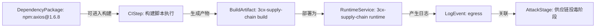
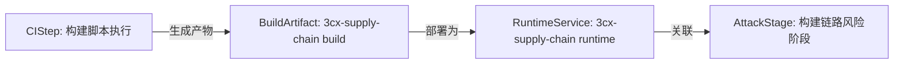

# 知识图谱驱动的真实攻击路径研判报告

生成时间：2026-06-25 10:47:36 UTC

## 风险摘要

- 综合风险评分：100 / 100
- 风险等级：critical
- 打开风险：7 项，其中严重风险 3 项
- 图谱节点：195 个
- 图谱关系：146 条
- 统一资产：403 个
- 证据片段：399 条
- 运行期日志事件：574 条
- 已识别攻击路径：3 条
- 可行动攻击路径：2 条
- 高度可信真实路径：1 条
- 平均路径置信度：71%
- 路径判定分布：likely-real-attack-path=1, provenance-risk-path=1
- 参考模型：GUAC 软件树/证据树可达性、OpenCTI observable 关系与置信度、NetworkX 路径评分、in-toto/SLSA 可信证据链、BloodHound 式入口到目标路径呈现

## 路径判定

本报告不再只列“发现了哪些漏洞”，而是判断这些证据能否串成一次真实攻击路径。

## 攻击路径

### 1. 证据可串成供应链投毒到运行期异常的攻击路径

一句话结论：能串成一次高度可信的真实攻击路径：入口、构建、产物、运行期行为连续可达，综合置信度 79%。

- 路径判定：likely-real-attack-path
- 综合置信度：79%
- 严重级别：critical
- 路径评分：100 / 100
- 影响资产：npm:axios@1.6.8 -> 构建脚本执行 -> 3cx-supply-chain build -> 3cx-supply-chain runtime -> egress
- 修复优先级：P0
- 攻击映射：T1195
- 参考模型：GUAC, SLSA, in-toto, BloodHound CE, MITRE ATT&CK STIX

路径步骤：
- npm:axios@1.6.8 --可进入构建--> 构建脚本执行（GUAC，置信度 72%）：A poisoned dependency can run install-time behavior or influence generated artifacts.
- 构建脚本执行 --生成产物--> 3cx-supply-chain build（SLSA/in-toto，置信度 78%）：A compromised step or builder can produce a modified artifact.
- 3cx-supply-chain build --部署为--> 3cx-supply-chain runtime（ARTIFACT_DEPLOYED_AS，置信度 82%）：Workspace runtime metadata links the build artifact to the deployed service.
- 3cx-supply-chain runtime --产生日志--> egress（Runtime evidence，置信度 84%）：Runtime logs show whether the build-time risk manifested after deployment.
- egress --关联--> 供应链投毒阶段（evidence，置信度 50%）：NormalizedLogEvent

可信证据链：
- GUAC：软件树中存在可达依赖节点；主体=npm:axios@1.6.8；状态=observed
- in-toto：构建步骤将 material 转换为 product；主体=构建脚本执行；状态=needs-attestation
- SLSA：产物需要 subject digest、builder identity 和 materials provenance；主体=3cx-supply-chain build；状态=gap
- Runtime evidence：运行期行为证明风险可能已经触发；主体=egress；状态=observed

证据缺口：
- 路径关系可达，但部分边是启发式关联；建议补充时间线、产物哈希或来源 IP 证据。

关键封堵点：
- npm:axios@1.6.8：固定私有源、锁定版本并清理缓存包。
- 构建脚本执行：收敛权限、固定 Action 到 commit SHA，并使用干净 runner。
- 3cx-supply-chain build：重新构建并校验产物哈希/provenance。
- 3cx-supply-chain runtime：回滚或隔离服务实例，保留日志和镜像证据。
- egress：封禁相关来源/目的地址并扩大同时间窗排查。

证据摘要：
- npm:axios@1.6.8：OSV: GHSA-35jp-ww65-95wh; OSV: GHSA-3g43-6gmg-66jw; OSV: GHSA-3p68-rc4w-qgx5; OSV: GHSA-3w6x-2g7m-8v23; OSV: GHSA-43f...
- 未知域名外联：checkout-api -> 185.199.108.153:443

### 2. 证据可串成构建链路完整性受损路径

一句话结论：能串成构建完整性风险路径，但还需要 provenance/attestation 才能证明产物确被篡改，综合置信度 62%。

- 路径判定：provenance-risk-path
- 综合置信度：62%
- 严重级别：critical
- 路径评分：100 / 100
- 影响资产：构建脚本执行 -> 3cx-supply-chain build -> 3cx-supply-chain runtime
- 修复优先级：P0
- 攻击映射：Build provenance and integrity
- 参考模型：SLSA, in-toto, GUAC, BloodHound CE

路径步骤：
- 构建脚本执行 --生成产物--> 3cx-supply-chain build（SLSA/in-toto，置信度 78%）：A compromised step or builder can produce a modified artifact.
- 3cx-supply-chain build --部署为--> 3cx-supply-chain runtime（ARTIFACT_DEPLOYED_AS，置信度 82%）：Workspace runtime metadata links the build artifact to the deployed service.
- 3cx-supply-chain runtime --关联--> 构建链路风险阶段（evidence，置信度 50%）：Runtime

可信证据链：
- in-toto：构建步骤将 material 转换为 product；主体=构建脚本执行；状态=needs-attestation
- SLSA：产物需要 subject digest、builder identity 和 materials provenance；主体=3cx-supply-chain build；状态=gap

证据缺口：
- 路径节点没有关联证据片段，需要补充扫描结果或日志。

关键封堵点：
- 构建脚本执行：收敛权限、固定 Action 到 commit SHA，并使用干净 runner。
- 3cx-supply-chain build：重新构建并校验产物哈希/provenance。
- 3cx-supply-chain runtime：回滚或隔离服务实例，保留日志和镜像证据。

证据摘要：
- 暂无证据。

## 关联高危问题

| 编号 | 等级 | 评分 | 风险 | 影响资产 | 来源 |
| --- | --- | ---: | --- | --- | --- |
| finding-node:39fc7e077f2303c3 | critical | 100 | axios has exploitable VEX context | axios@1.6.8 | CycloneDX |
| finding-node:28e5371f350de902 | critical | 100 | starlette vulnerability needs reachability triage | starlette@1.2.1 | CycloneDX |
| finding-node:56eb690f9b206f6b | critical | 93 | 构建后服务出现异常外联和敏感接口探测 | 日志风险 | WorkspaceSummary |
| finding-node:8dba1092849935b1 | critical | 92 | 敏感接口异常访问 | workspace | NormalizedLogEvent |
| finding-node:308f1a2829be7f0a | critical | 92 | 未知域名外联 | workspace | NormalizedLogEvent |
| finding-node:d2b7c5469a9f5b36 | high | 82 | SQL 注入探测 | workspace | NormalizedLogEvent |
| finding-node:3ec17dab6a7831d7 | high | 82 | 暴力破解/令牌探测 | workspace | NormalizedLogEvent |
| finding-node:fba8f72b777d3cb3 | high | 75 | zizmor: unpinned-uses | sample-repo/.github/workflows/desktop-release.yml | SARIF |
| finding-node:f735da63cca06261 | high | 75 | zizmor: unpinned-uses | sample-repo/.github/workflows/desktop-release.yml | SARIF |
| finding-node:2cfedac2f129761c | medium | 68 | electron matched OSV vulnerabilities | electron@25.9.8 | CycloneDX |
| finding-node:0656b074c11497a7 | medium | 62 | zizmor: artipacked | sample-repo/.github/workflows/desktop-release.yml | SARIF |

## 证据链

| 序号 | 时间 | 证据类型 | 关联资产 | 证据摘要 | 来源模型 |
| ---: | --- | --- | --- | --- | --- |
| 1 | 2026-06-25 10:46 | sbom-component-risk | npm:axios@1.6.8 | OSV: GHSA-35jp-ww65-95wh; OSV: GHSA-3g43-6gmg-66jw; OSV: GHSA-3p68-rc4w-qgx5; OSV: GHSA-3w6x-2g7m-8v23; OSV: GHSA-43fc-jf86-j433; OSV: GHSA-445q-vr5w-6q77; OSV: GHSA-4hjh-wcwx-x... | CycloneDX |
| 2 | 2026-05-30 03:07:04 | runtime-log-finding | egress | checkout-api -> 185.199.108.153:443 | NormalizedLogEvent |

## 多模态证据融合

暂无多模态证据。

## GraphRAG / GNN 风险增强

- GNN 模型类型：-
- 训练设备：-；torch=-；CUDA=-
- 测试集 F1：-
- 带 GNN 分数的图谱节点：105
- 高风险 GNN 节点：4
- GraphRAG embedding 命中：0
- 说明：当前指标基于构造数据集和本地负样本，不能等同真实世界恶意包检测准确率。

| 依赖节点 | GNN 分数 | 标签 | 解释 |
| --- | ---: | --- | --- |
| npm:axios@1.6.8 | 0.90 | high | rule fallback score used because no GNN model was available |
| npm:axios@1.6.8 | 0.90 | high | rule fallback score used because no GNN model was available |
| npm:electron@25.9.8 | 0.84 | high | rule fallback score used because no GNN model was available |
| npm:electron@25.9.8 | 0.84 | high | rule fallback score used because no GNN model was available |
| pypi:starlette@1.2.1 | 0.70 | elevated | rule fallback score used because no GNN model was available |

GraphRAG 证据摘要：
- 当前报告未附带 assistant GraphRAG 查询结果。

证据缺口：
- 当前 GraphRAG 查询未报告证据缺口。

## 修复建议

- **P0 · 证据可串成供应链投毒到运行期异常的攻击路径**：隔离高危依赖，使用干净 runner 重新构建，校验产物哈希，并排查运行期外联。
- **P0 · 证据可串成构建链路完整性受损路径**：收敛 workflow 权限，第三方 Action 固定到 commit SHA，并为产物增加 provenance/attestation。

## 附录

### SBOM / Dependency-Track 风险摘要

- SBOM 组件数量：194
- 依赖风险数量：3
- 最高依赖风险：100 / 100
- VEX statement：59
- VEX affected / under investigation：7
- VEX not affected / fixed：52
- 代码可达依赖：2
- 运行期日志命中：0

### SARIF / DefectDojo 风险摘要

- SARIF 结果数量：3
- 代码风险数量：0
- CI/CD 风险数量：3

### 产物可信验证摘要

- 产物：-
- SHA256：-
- 可信评分：0 / 100
- 检查项数量：0
- 产物可信风险：0

### 日志证据摘要

- 日志风险数量：0
- 图谱证据数量：399

### 开源参考

- GUAC: https://docs.guac.sh/guac/
- GUAC Ontology: https://docs.guac.sh/guac/guac-ontology/
- MITRE ATT&CK STIX Data: https://github.com/mitre-attack/attack-stix-data
- SLSA: https://slsa.dev/spec/v1.2/provenance
- in-toto: https://github.com/in-toto/in-toto
- BloodHound CE: https://specterops.io/bloodhound-community-edition/
- NetworkX: https://networkx.org/
- React Flow: https://reactflow.dev/
- CycloneDX: https://cyclonedx.org/specification/overview/
- SARIF: https://www.oasis-open.org/standard/sarif-v2-1-0/
- OWASP Dependency-Track: https://dependencytrack.org/
- DefectDojo: https://docs.defectdojo.com/
- FFmpeg: https://www.ffmpeg.org/index.html
- OpenCV: https://opencv.org/about/

