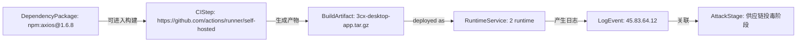
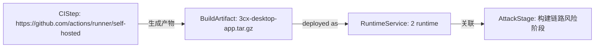

# SupplyGuard KG 供应链攻击溯源报告

生成时间：2026-06-30 04:53:26 UTC

> [!CAUTION]
> 当前报告面向供应链攻击检测与溯源研判。请先处理“用户该做什么”中的最高优先级和高优先级动作，再展开后续证据细节。

## 1. 一句话结论

建议优先处理「2」项目中的最高风险链路：证据可串成供应链投毒到运行期异常的攻击路径。

一句话结论：能串成一次高度可信的真实攻击路径：入口、构建、产物、运行期行为连续可达，综合置信度 83%。

- 综合风险：100 / 100（critical）
- 首要依赖风险对象：axios，风险分 100
- 运行期证据：app -> 45.83.64.12
- 处置优先级：隔离高危依赖，使用干净 runner 重新构建，校验产物哈希，并排查运行期外联。

立即建议：
1. 隔离或替换高危依赖。
2. 使用干净 runner 重新构建。
3. 校验 artifact 哈希、签名、provenance 和 attestation。
4. 排查运行期外联、敏感接口访问和异常日志。
5. 如确认影响发布或运行环境，回滚版本并吊销相关 Token。

## 2. 用户该做什么

| 优先级 | 动作 | 原因 |
| --- | --- | --- |
| 最高优先级 | 阻断发布并冻结当前产物 | 当前最高风险路径为：证据可串成供应链投毒到运行期异常的攻击路径。先避免风险进入用户环境。 |
| 最高优先级 | 隔离高危依赖并复核来源 | 优先检查 axios 是否为 AI 推荐、手动引入、依赖混淆或漏洞版本。 |
| 高优先级 | 使用干净 Runner 重新构建 | 重新生成 3cx-desktop-app.tar.gz，并校验 digest、commit、workflow、builder、provenance 和 attestation。 |
| 高优先级 | 排查运行期外联和敏感访问 | 检查外联 IP、敏感接口访问、异常日志和受影响主机。 |
| 中优先级 | 补齐证据并复扫攻击链 | 补充签名、可信 builder、hash baseline、Git 提交记录和 AI 生成来源标记。 |

## 3. 风险总览

| 指标 | 结果 |
| --- | --- |
| 综合风险 | 100 / 100 |
| 风险等级 | 严重 |
| 高可信真实路径 | 1 条 |
| 处置优先级 | 最高优先级 |

## 4. 攻击路径总览

**最高优先级路径：** 证据可串成供应链投毒到运行期异常的攻击路径

- 路径判定：likely-real-attack-path
- 综合置信度：83%
- 修复优先级：最高优先级
- 影响资产：npm:axios@1.6.8 -> https://github.com/actions/runner/self-hosted -> 3cx-desktop-app.tar.gz -> 2 runtime -> 45.83.64.12

## 5. 关键证据与风险信号

| 编号 | 等级 | 评分 | 风险 | 影响资产 | 来源 |
| --- | --- | ---: | --- | --- | --- |
| finding-node:39fc7e077f2303c3 | critical | 100 | axios has exploitable VEX context | axios@1.6.8 | CycloneDX |
| finding-node:eb21c3483210fac8 | critical | 100 | starlette vulnerability needs reachability triage | starlette@1.2.1 | CycloneDX |
| finding-node:a68bf17582361bda | critical | 98 | 产物 digest 与 attestation subject 不一致或缺失 | artifact_trust | SLSA/in-toto |
| finding-node:e33b2b17a3bb2123 | critical | 97 | 依赖与 CI/CD 风险后出现运行期外联/敏感接口访问 | 证据链 | WorkspaceSummary |
| finding-node:8455069e2b45547b | critical | 92 | Suspicious External Egress IP | log_audit | NormalizedLogEvent |
| finding-node:04b3f26bba4e141f | critical | 92 | 异常外联 IP | workspace | NormalizedLogEvent |
| finding-node:d170778c8d4d3ea2 | high | 87 | runner 环境不符合策略 | artifact_trust | SLSA/in-toto |
| finding-node:cdbb2c3dac29a0f7 | high | 84 | Suspicious External Egress IP | log_audit | NormalizedLogEvent |
| finding-node:8cea470b195991a9 | high | 82 | 异常外联 IP | workspace | NormalizedLogEvent |
| finding-node:fba8f72b777d3cb3 | high | 75 | zizmor: unpinned-uses | sample-repo/.github/workflows/desktop-release.yml | SARIF |
| finding-node:f735da63cca06261 | high | 75 | zizmor: unpinned-uses | sample-repo/.github/workflows/desktop-release.yml | SARIF |
| finding-node:2cfedac2f129761c | medium | 68 | electron matched OSV vulnerabilities | electron@25.9.8 | CycloneDX |

## 6. 攻击路径详情

本节展示系统如何把依赖、CI/CD、产物可信和运行期日志串成可解释路径。长证据默认折叠，便于先看结论。

### 1. 证据可串成供应链投毒到运行期异常的攻击路径

一句话结论：能串成一次高度可信的真实攻击路径：入口、构建、产物、运行期行为连续可达，综合置信度 83%。

- 路径判定：likely-real-attack-path
- 综合置信度：83%
- 严重级别：严重
- 路径评分：100 / 100
- 影响资产：npm:axios@1.6.8 -> https://github.com/actions/runner/self-hosted -> 3cx-desktop-app.tar.gz -> 2 runtime -> 45.83.64.12
- 修复优先级：最高优先级
- 攻击映射：T1195
- 参考模型：GUAC, SLSA, in-toto, BloodHound CE, MITRE ATT&CK STIX

路径步骤：
- npm:axios@1.6.8 --可进入构建--> https://github.com/actions/runner/self-hosted（GUAC，置信度 72%）：A poisoned dependency can run install-time behavior or influence generated artifacts.
- https://github.com/actions/runner/self-hosted --生成产物--> 3cx-desktop-app.tar.gz（SLSA/in-toto，置信度 78%）：A compromised step or builder can produce a modified artifact.
- 3cx-desktop-app.tar.gz --deployed as--> 2 runtime（Runtime deployment，置信度 82%）：Workspace runtime metadata links the verified artifact to the deployed service.
- 2 runtime --产生日志--> 45.83.64.12（Runtime evidence，置信度 84%）：Runtime logs show whether the build-time risk manifested after deployment.
- 45.83.64.12 --关联--> 供应链投毒阶段（evidence，置信度 50%）：NormalizedLogEvent

可信证据链：
- GUAC：软件树中存在可达依赖节点；主体=npm:axios@1.6.8；状态=observed
- in-toto：构建步骤将 material 转换为 product；主体=https://github.com/actions/runner/self-hosted；状态=needs-attestation
- SLSA：产物需要 subject digest、builder identity 和 materials provenance；主体=3cx-desktop-app.tar.gz；状态=observed
- Runtime evidence：运行期行为证明风险可能已经触发；主体=45.83.64.12；状态=observed

证据缺口：
- 当前路径未发现明显证据缺口。

关键封堵点：
- npm:axios@1.6.8：固定私有源、锁定版本并清理缓存包。
- https://github.com/actions/runner/self-hosted：收敛权限、固定 Action 到 commit SHA，并使用干净 runner。
- 3cx-desktop-app.tar.gz：重新构建并校验产物哈希/provenance。
- 2 runtime：回滚或隔离服务实例，保留日志和镜像证据。
- 45.83.64.12：封禁相关来源/目的地址并扩大同时间窗排查。

证据摘要：
- Artifact provenance attestation：3cx-desktop-app.tar.gz sha256:ac8df1c289da9af5f94278b8e55af440077b05e905d4c61a277bad12f7294183; repo=https://github.c...
- artifact_digest_matches_subject：fail: artifact sha256:ac8df1c289da9af5f94278b8e55af440077b05e905d4c61a277bad12f7294183 != attestation subject sha256:...
- artifact_hash_baseline：skipped: No historical hash baseline configured.
- attestation_max_age：pass: attestation age is 450.59 hours
- builder_trusted：warn: No trusted_builders configured.

### 2. 证据可串成构建链路完整性受损路径

一句话结论：能串成构建完整性风险路径，但还需要 provenance/attestation 才能证明产物确被篡改，综合置信度 67%。

- 路径判定：provenance-risk-path
- 综合置信度：67%
- 严重级别：严重
- 路径评分：100 / 100
- 影响资产：https://github.com/actions/runner/self-hosted -> 3cx-desktop-app.tar.gz -> 2 runtime
- 修复优先级：最高优先级
- 攻击映射：Build provenance and integrity
- 参考模型：SLSA, in-toto, GUAC, BloodHound CE

路径步骤：
- https://github.com/actions/runner/self-hosted --生成产物--> 3cx-desktop-app.tar.gz（SLSA/in-toto，置信度 78%）：A compromised step or builder can produce a modified artifact.
- 3cx-desktop-app.tar.gz --deployed as--> 2 runtime（Runtime deployment，置信度 82%）：Workspace runtime metadata links the verified artifact to the deployed service.
- 2 runtime --关联--> 构建链路风险阶段（evidence，置信度 50%）：Runtime

可信证据链：
- in-toto：构建步骤将 material 转换为 product；主体=https://github.com/actions/runner/self-hosted；状态=needs-attestation
- SLSA：产物需要 subject digest、builder identity 和 materials provenance；主体=3cx-desktop-app.tar.gz；状态=observed

证据缺口：
- 路径关系可达，但部分边是启发式关联；建议补充时间线、产物哈希或来源 IP 证据。

关键封堵点：
- https://github.com/actions/runner/self-hosted：收敛权限、固定 Action 到 commit SHA，并使用干净 runner。
- 3cx-desktop-app.tar.gz：重新构建并校验产物哈希/provenance。
- 2 runtime：回滚或隔离服务实例，保留日志和镜像证据。

证据摘要：
- Artifact provenance attestation：3cx-desktop-app.tar.gz sha256:ac8df1c289da9af5f94278b8e55af440077b05e905d4c61a277bad12f7294183; repo=https://github.c...
- artifact_digest_matches_subject：fail: artifact sha256:ac8df1c289da9af5f94278b8e55af440077b05e905d4c61a277bad12f7294183 != attestation subject sha256:...
- artifact_hash_baseline：skipped: No historical hash baseline configured.
- attestation_max_age：pass: attestation age is 450.59 hours
- builder_trusted：warn: No trusted_builders configured.

### 3. 产物可信链路验证路径

一句话结论：产物 3cx-desktop-app.tar.gz 的可信链存在阻断项；需要复核 commit 2222222222222222222222222222222222222222 -> .github/workflows/desktop-release.yml -> https://github.com/actions/runner/self-hosted -> artifact -> attestation 的 digest、签名和策略匹配结果。

```mermaid
flowchart LR
  N1["SourceCommit: commit 2222222222222222222222222222222222222222"]
  N2["Workflow: .github/workflows/desktop-release.yml"]
  N3["TrustedBuilder: https://github.com/actions/runner/self-hosted"]
  N4["BuildArtifact: 3cx-desktop-app.tar.gz"]
  N5["Attestation: 3cx-desktop-app.tar.gz"]
  N6["Finding: 产物 digest 与 attestation subject 不一致或缺失"]
  N7["AttackStage: 构建链路风险阶段"]
  N1 -->|triggers workflow| N2
  N2 -->|runs on| N3
  N3 -->|produces artifact| N4
  N4 -->|attested by| N5
  N5 -->|blocks proof| N6
  N6 -->|关联| N7
```

- 路径判定：provenance-risk-path
- 综合置信度：50%
- 严重级别：严重
- 路径评分：36 / 100
- 影响资产：commit 2222222222222222222222222222222222222222 -> .github/workflows/desktop-release.yml -> https://github.com/actions/runner/self-hosted -> 3cx-desktop-app.tar.gz -> 3cx-desktop-app.tar.gz
- 修复优先级：最高优先级
- 攻击映射：Verify artifact provenance
- 参考模型：SLSA, in-toto, Sigstore Cosign, GitHub Artifact Attestations, GUAC

路径步骤：
- commit 2222222222222222222222222222222222222222 --triggers workflow--> .github/workflows/desktop-release.yml（SLSA materials，置信度 90%）：Provenance binds the source repository commit/ref to the release workflow invocation.
- .github/workflows/desktop-release.yml --runs on--> https://github.com/actions/runner/self-hosted（SLSA builder identity，置信度 90%）：Provenance runDetails links the allowed workflow to the trusted builder identity.
- https://github.com/actions/runner/self-hosted --produces artifact--> 3cx-desktop-app.tar.gz（SLSA provenance，置信度 88%）：Trusted builder identity is the execution root that produced the artifact subject digest.
- 3cx-desktop-app.tar.gz --attested by--> 3cx-desktop-app.tar.gz（SLSA/in-toto，置信度 92%）：Artifact trust scan parsed a provenance attestation for this artifact digest.
- 3cx-desktop-app.tar.gz --blocks proof--> 产物 digest 与 attestation subject 不一致或缺失（SLSA/in-toto policy，置信度 90%）：Artifact trust finding blocks or weakens the provenance proof chain.
- 产物 digest 与 attestation subject 不一致或缺失 --关联--> 构建链路风险阶段（evidence，置信度 50%）：SLSA/in-toto

可信证据链：
- SLSA materials：source repository and commit/ref are claimed by provenance；主体=commit 2222222222222222222222222222222222222222；状态=observed
- -：-；主体=-；状态=-
- -：-；主体=-；状态=-
- SLSA：产物需要 subject digest、builder identity 和 materials provenance；主体=3cx-desktop-app.tar.gz；状态=observed
- -：-；主体=-；状态=-

证据缺口：
- 当前路径未发现明显证据缺口。

关键封堵点：
- 3cx-desktop-app.tar.gz：重新构建并校验产物哈希/provenance。

证据摘要：
- Artifact provenance attestation：3cx-desktop-app.tar.gz sha256:ac8df1c289da9af5f94278b8e55af440077b05e905d4c61a277bad12f7294183; repo=https://github.c...
- artifact_digest_matches_subject：fail: artifact sha256:ac8df1c289da9af5f94278b8e55af440077b05e905d4c61a277bad12f7294183 != attestation subject sha256:...
- artifact_hash_baseline：skipped: No historical hash baseline configured.
- attestation_max_age：pass: attestation age is 450.59 hours
- builder_trusted：warn: No trusted_builders configured.

## 7. AI 辅助研判

### 研判结论

AI 辅助研判未单独证明攻击成立，但识别出 3 个需要复核的可疑对象。建议把它们作为风险排序参考，最终仍以依赖、CI/CD、产物可信和运行日志证据为准。

| 指标 | 结果 |
| --- | --- |
| 高风险 AI 节点 | 0 个 |
| 重点复核对象 | 3 个 |
| GraphRAG 证据命中 | 0 条 |

### 重点关注对象

| 对象 | AI 风险分 | 建议 |
| --- | ---: | --- |
| pypi:x-trader-build-agent@4.7.1 | 46% | 复核来源、版本、安装脚本和是否由 AI 推荐引入 |
| pypi:x-trader-build-agent@4.7.1 | 46% | 复核来源、版本、安装脚本和是否由 AI 推荐引入 |
| npm:x-trader-codec@4.7.1 | 44% | 复核来源、版本、安装脚本和是否由 AI 推荐引入 |

### 说明

GNN 用于根据依赖关系和图谱上下文给节点重新排序；GraphRAG 用于把相关证据串联起来。该模块只辅助判断“哪些节点更值得优先看”，不单独作为攻击成立依据。

## 8. Vibe Coding 风险归因

当前证据不能直接证明风险一定由 AI 生成，但可以判断这些风险符合 Vibe Coding 场景中“AI 推荐 / 用户接受 / 快速进入工程流程”的典型进入方式。

| 风险来源 | 判断 | 证据说明 |
| --- | --- | --- |
| AI 推荐依赖 | 疑似 | 存在高风险依赖进入依赖清单，但当前缺少 AI 对话或提交来源记录。 |
| AI 生成代码 | 未确认 | 当前报告未包含可证明代码由 AI 生成的元数据。 |
| AI 生成 CI/CD 配置 | 无法判断 | 需要结合 workflow 文件、提交记录和 AI 会话记录确认。 |
| AI 生成 Docker/IaC 配置 | 未确认 | 如后续上传 Dockerfile、Kubernetes 或 Terraform 配置，可继续归因。 |
| 开发者手动引入 | 无法排除 | 缺少提交人、提交消息和代码评审上下文，不能排除人工引入。 |
| 未知来源 | 是 | 当前缺少依赖和配置的引入来源标记。 |

建议后续在项目导入或扫描任务中增加来源标记：AI 生成代码、AI 推荐依赖、AI 生成 CI/CD 配置、AI 生成 Docker/IaC 配置、开发者手动引入或未知。

## 9. 影响评估

| 影响对象 | 判断 | 说明 |
| --- | --- | --- |
| 用户数据 | 需要排查 | 运行期日志可用于确认是否访问用户数据、敏感接口或异常外联。 |
| 构建凭据 | 未确认 | 若发现明文密钥、Token 或高权限 workflow，需要立即轮换凭据。 |
| 发布渠道 | 可能受影响 | 产物 digest、provenance、builder 或 runner 不可信时，需要暂停发布。 |
| 下游系统 | 需要排查 | 如果受污染产物已分发，需要确认下游部署范围。 |
| 是否回滚 | 建议评估 | 当产物可信失败或运行期异常成立时，应优先回滚到可信版本。 |
| 是否吊销 Token | 建议评估 | 如果日志或配置显示凭据可能泄露，应吊销并重新签发。 |

## 10. 技术明细

展开扫描范围、证据完整性、阶段研判和证据链

### 扫描范围

| 项目 | 数值 |
| --- | ---: |
| 项目名称 | 2 |
| 文件总数 | 29 |
| 可扫描文件 | 23 |
| 被忽略文件 | 5 |
| 二进制 / 压缩包 | 1 |
| 依赖清单 | 3 个 |
| CI/CD 配置 | 0 个 |
| 主要语言 | JSON |

文件类型覆盖：

| 类型 | 文件数 | 占比 |
| --- | ---: | ---: |
| JSON | 10 | 100% |
| Markdown | 3 | 0% |
| YAML | 2 | 0% |
| JavaScript | 3 | 0% |

### 工程证据清单

### 已识别依赖清单

- sample-repo/package-lock.json
- sample-repo/package.json
- sample-repo/requirements.txt

### 已识别 CI/CD 配置

未发现 CI/CD 配置文件。

### 产物与来源证明

- 产物：3cx-desktop-app.tar.gz
- attestation / provenance：C:\Users\86189\Desktop\sysml2\cases\3cx-supply-chain\artifacts\3cx-desktop-app.intoto.jsonl
- 产物可信检查项：10 项

### 日志材料

- 日志事件：5
- 日志风险：2
- 运行期风险等级：critical

### 证据完整性提醒

1. 未发现 CI/CD 配置，无法完整判断 workflow 权限、Action 固定版本、runner 可信度和远程脚本执行。
2. 未发现 CI/CD 配置文件，无法完整判断构建链权限、Action 版本和 runner 可信度。
3. 1 binary or archive files were skipped. 这些文件不能按源码方式审计，需要进入产物可信门禁校验哈希、签名和 provenance。
4. 当前项目来自本地路径导入，浏览器侧不会直接读取任意文件，扫描以服务端工作区材料为准。

### 攻击阶段研判

### 1. 入口风险

首要依赖对象：axios，风险分 100。依赖风险可能来自可疑版本、依赖混淆、漏洞版本、安装脚本或相似恶意包特征。

### 2. 执行风险

系统会检查 postinstall、install script、curl | bash、远程脚本下载、明文密钥和危险代码调用。若依赖安装脚本与 CI/CD 执行证据同时存在，应提高优先级。

### 3. 构建风险

CI/CD 配置数量：0。当前缺少 workflow 材料，构建链风险无法完整判断。

### 4. 产物风险

产物可信风险：4 项。需要重点确认 artifact SHA256、attestation subject、commit/ref、workflow、builder、runner 和签名是否匹配策略。

### 5. 运行风险

日志事件：5，运行期证据：app -> 45.83.64.12。如果异常外联、敏感接口访问或 SQL 注入探测与依赖/构建链路径相连，应视为运行期印证。

### 6. 影响风险

当前最高路径置信度：83%。若路径已经连接依赖、构建、产物和运行日志，需要进一步确认用户数据、Token、发布渠道和下游系统是否受影响。

### 处置建议原文

### 立即处理

- **最高优先级 · 证据可串成供应链投毒到运行期异常的攻击路径**：隔离高危依赖，使用干净 runner 重新构建，校验产物哈希，并排查运行期外联。
- **最高优先级 · 证据可串成构建链路完整性受损路径**：收敛 workflow 权限，第三方 Action 固定到 commit SHA，并为产物增加 provenance/attestation。
- **最高优先级 · 产物可信链路验证路径**：将该产物可信验证结果作为发布门禁；digest、签名、builder、workflow 或来源任一失败时阻断发布。

### 短期修复

- 引入 Git Hook，在提交前阻断硬编码密钥、可疑依赖和危险脚本。
- 引入 CI Gate，在 PR 阶段阻断高危依赖、危险 workflow、权限过宽和未固定 Action。
- 引入 Release Gate，在发布前校验 artifact、attestation、builder、workflow、commit/ref 和签名。

### 后续增强

- 先冻结或替换受影响依赖，并重新生成 SBOM 与 VEX。
- 复核代码 import、入口路径和运行期日志，确认 affected 与待判研项。
- 使用干净 runner 重新构建产物，校验 digest、builder、workflow 和 provenance。
- 把已证实路径加入攻击链图谱，并在报告中标出证据缺口和处置优先级。

### 证据链

| 序号 | 时间 | 证据类型 | 关联资产 | 证据摘要 | 来源模型 |
| ---: | --- | --- | --- | --- | --- |
| 1 | 2026-06-30 04:35 | artifact-provenance | 3cx-desktop-app.tar.gz | 3cx-desktop-app.tar.gz sha256:ac8df1c289da9af5f94278b8e55af440077b05e905d4c61a277bad12f7294183; repo=https://github.com/3cx/desktop-app; commit=222222222222222222222222222222222... | SLSA/in-toto |
| 2 | 2026-06-30 04:35 | artifact-trust-check | 3cx-desktop-app.tar.gz | fail: artifact sha256:ac8df1c289da9af5f94278b8e55af440077b05e905d4c61a277bad12f7294183 != attestation subject sha256:000000000000000000000000000000000000000000000000000000000000... | SLSA/in-toto |
| 3 | 2026-06-30 04:35 | artifact-trust-check | 3cx-desktop-app.tar.gz | skipped: No historical hash baseline configured. | SLSA/in-toto |
| 4 | 2026-06-30 04:35 | artifact-trust-check | 3cx-desktop-app.tar.gz | pass: attestation age is 450.59 hours | SLSA/in-toto |
| 5 | 2026-06-30 04:35 | artifact-trust-check | 3cx-desktop-app.tar.gz | warn: No trusted_builders configured. | SLSA/in-toto |
| 6 | 2026-06-30 04:35 | artifact-trust-check | 3cx-desktop-app.tar.gz | skipped: No expected_commit or allowed_branches configured. | SLSA/in-toto |
| 7 | 2026-06-30 04:35 | artifact-trust-check | 3cx-desktop-app.tar.gz | pass: https://slsa.dev/provenance/v1 | SLSA/in-toto |
| 8 | 2026-06-30 04:35 | artifact-trust-check | 3cx-desktop-app.tar.gz | fail: self-hosted runner is not allowed by policy: self-hosted | SLSA/in-toto |
| 9 | 2026-06-30 04:35 | artifact-trust-check | 3cx-desktop-app.tar.gz | warn: Error: HTTP 404: Not Found (https://api.github.com/repos/3cx/desktop-app/attestations/sha256:ac8df1c289da9af5f94278b8e55af440077b05e905d4c61a277bad12f7294183?per_page=30&p... | SLSA/in-toto |
| 10 | 2026-06-30 04:35 | artifact-trust-check | 3cx-desktop-app.tar.gz | skipped: No expected_repo configured. | SLSA/in-toto |
| 11 | 2026-06-30 04:35 | artifact-trust-check | 3cx-desktop-app.tar.gz | skipped: No allowed_workflows configured. | SLSA/in-toto |
| 12 | 2026-06-30 04:35 | artifact-trust-finding | 3cx-desktop-app.tar.gz | self-hosted runner is not allowed by policy: self-hosted | SLSA/in-toto |
| 13 | 2026-06-30 04:35 | artifact-trust-finding | 3cx-desktop-app.tar.gz | No trusted_builders configured. | SLSA/in-toto |
| 14 | 2026-06-30 04:35 | artifact-trust-finding | 3cx-desktop-app.tar.gz | artifact sha256:ac8df1c289da9af5f94278b8e55af440077b05e905d4c61a277bad12f7294183 != attestation subject sha256:0000000000000000000000000000000000000000000000000000000000000000 | SLSA/in-toto |
| 15 | 2026-06-30 04:35 | artifact-trust-finding | 3cx-desktop-app.tar.gz | Error: HTTP 404: Not Found (https://api.github.com/repos/3cx/desktop-app/attestations/sha256:ac8df1c289da9af5f94278b8e55af440077b05e905d4c61a277bad12f7294183?per_page=30&predica... | SLSA/in-toto |
| 16 | 2026-06-30 04:32 | sbom-component-risk | npm:axios@1.6.8 | OSV: GHSA-35jp-ww65-95wh; OSV: GHSA-3g43-6gmg-66jw; OSV: GHSA-3p68-rc4w-qgx5; OSV: GHSA-3w6x-2g7m-8v23; OSV: GHSA-43fc-jf86-j433; OSV: GHSA-445q-vr5w-6q77; OSV: GHSA-4hjh-wcwx-x... | CycloneDX |
| 17 | 2026-06-11 11:30:02 | runtime-log-finding | 45.83.64.12 | {"time":"2026-06-11T11:30:02Z","source":"app","host":"customer-pc-01","process":"3cx-desktop-app","event":"...pp beacon egress destination 45.83.64.12 for cdn-update.example.inv... | NormalizedLogEvent |

### 多模态证据融合

- 多模态证据：1 条
- 安全实体：0 个
- 规则命中：0 条
- 多模态风险：low / 0
- 参考模型：GUAC 负责软件供应链可达关系，OpenCTI 负责 observable/置信度/first seen 语义，NetworkX 负责路径评分和多源证据连通性。

| Evidence ID | 类型 | 风险 | 关联实体 | 命中规则 | 识别文本摘要 |
| --- | --- | --- | --- | --- | --- |
| MME-20260630045132698681-41ACFFEF | image | low / 0 | - | - | 家庭所在地 学校所在地 乘车区间 光天大学 南京航空航天大学 艺 学 路37号 福建省南平市建瓯市新校场 漂阳站一 入学时间 出生年月 麻 证件号码 车 手 江苏省漂阳市 名 售 发 建瓯西 中 202309 20050311 162... |

### 路径修复建议

- **最高优先级 · 证据可串成供应链投毒到运行期异常的攻击路径**：隔离高危依赖，使用干净 runner 重新构建，校验产物哈希，并排查运行期外联。
- **最高优先级 · 证据可串成构建链路完整性受损路径**：收敛 workflow 权限，第三方 Action 固定到 commit SHA，并为产物增加 provenance/attestation。
- **最高优先级 · 产物可信链路验证路径**：将该产物可信验证结果作为发布门禁；digest、签名、builder、workflow 或来源任一失败时阻断发布。

