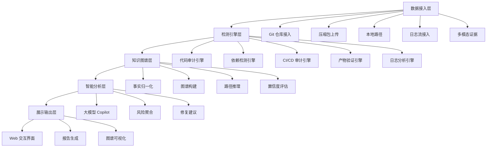
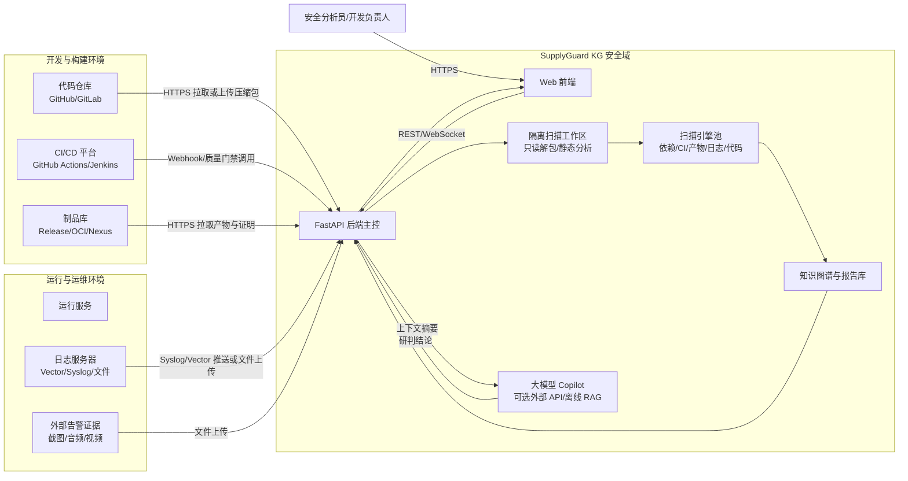
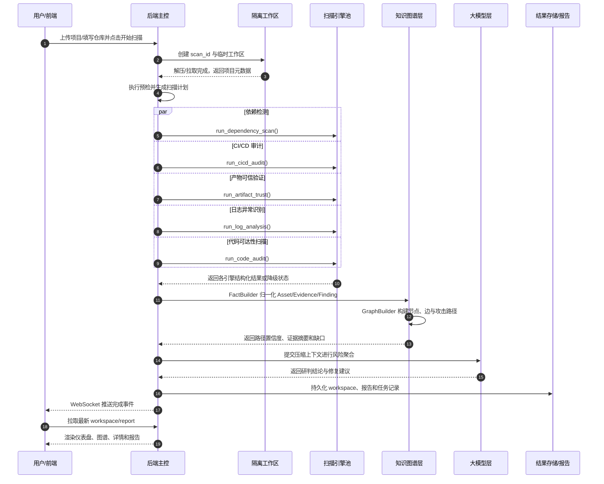
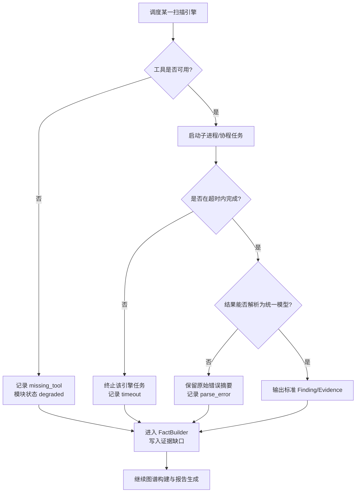

# 基于大模型与知识图谱的软件供应链攻击检测平台（SupplyGuard KG）

## 摘要

近年来，SolarWinds、Log4j、3CX 等软件供应链攻击事件频发，此类攻击通常具有隐蔽性强、攻击链条长、影响范围广的特点。现有安全工具多聚焦于依赖扫描、CI 配置检测或产物验证等单一环节，数据之间难以关联，攻击溯源仍然依赖安全专家手工拼接证据，效率较低且容易遗漏关键线索。针对上述问题，本作品设计并实现了覆盖软件全生命周期的供应链攻击检测平台 SupplyGuard KG。平台将项目导入与预检、依赖检测、CI/CD 构建链路审计、产物可信验证、运行期日志异常识别、知识图谱链路溯源、大模型智能溯源 Copilot 和安全报告生成整合为完整检测闭环。围绕“证据可关联、路径可解释、处置可落地”的目标，平台重点实现了基于知识图谱的多源证据融合与攻击路径推理、遵循 SLSA 标准的产物可信门禁，以及大模型辅助的风险研判能力。本作品可提升软件供应链攻击的检测与溯源效率，适用于企业 DevSecOps 流程嵌入、开源项目安全审计、软件发布门禁和供应链攻击应急取证等场景。

**关键词**：软件供应链安全；知识图谱；攻击溯源；SLSA；大模型；安全检测

---

## 第一章 作品概述

### 1.1 研究背景与意义

软件供应链攻击已成为当前网络安全领域最严峻的威胁之一。2020 年底曝光的 SolarWinds 事件中，攻击者通过篡改 Orion 平台的软件更新包，将 SUNBURST 后门植入全球超过 18,000 家机构的内部网络，波及美国政府机构、科技巨头及关键基础设施运营商。2021 年，Log4j 漏洞 CVE-2021-44228 的爆发揭示了开源组件生态的脆弱性，一个基础日志库中的远程代码执行漏洞，就足以影响全球大量 Java 应用。2023 年的 3CX 供应链攻击事件进一步展示了级联攻击的复杂性，攻击者先污染金融交易软件包，再借由该软件包感染 3CX 桌面客户端及其下游客户。

这些事件说明，现代软件供应链攻击并不是单点漏洞触发后的孤立事件，而是沿着开发、构建、发布和运行多个阶段逐步扩散的链式风险。其典型表现主要集中在三个方面：

- 攻击者常在代码构建、依赖引入或更新分发环节植入恶意逻辑，常规终端防护难以及时发现；
- 攻击路径可能从上游依赖污染、CI/CD 流水线劫持延伸到构建产物篡改和运行期外联，跨越多个生命周期阶段；
- 一旦供应链中的关键环节被突破，所有依赖该软件或服务的下游用户都会被纳入影响范围。

现有防护方案的不足，主要不在于缺少单点检测能力，而在于这些能力难以形成连续的证据链。多数工具只覆盖一个环节，Snyk、Dependabot 侧重依赖漏洞扫描，zizmor、actionlint 侧重 GitHub Actions 配置检测，SLSA 官方工具链侧重产物来源验证。依赖清单、CI 配置、构建产物证明和运行日志分散在不同系统中，安全分析人员需要手工关联多份结果，才能还原攻击路径。面对复杂供应链攻击事件时，这种方式往往需要数周甚至数月才能梳理出完整链路，处置窗口也会随之拉长。因此，构建一套贯穿软件全生命周期、能够融合多源安全数据并自动推理攻击路径的平台，具有明确的研究价值和现实意义。

### 1.2 国内外相关工作与横向对比

当前软件供应链安全领域已经形成若干类工具，但它们的覆盖边界和分析深度各不相同：

- **SCA 依赖检测类**主要以 Snyk、Dependabot、OWASP Dependency-Check 为代表，能够解析依赖清单、匹配公共漏洞数据库并生成 SBOM，但难以感知 CI/CD 配置、构建产物完整性和运行期异常行为；
- **CI/CD 安全扫描类**以 zizmor、actionlint、Checkov 的 CI 模式为代表，能够发现未固定版本 Action、权限配置过高等流水线风险，但通常不覆盖依赖层检测、产物验证和运行期数据关联；
- **产物可信验证类**以 cosign 和 SLSA 官方工具链为代表，能够通过数字签名与 Provenance 证明文件验证软件产物来源和完整性，但缺少对依赖风险、CI 配置风险和攻击溯源过程的支撑；
- **集成平台类**开始尝试整合多项能力，典型产品包括 Scribe Security、Chainguard Enforce 等，但商业部署成本较高，且往往绑定特定生态，难以灵活适配多样化场景。

下表从五个核心维度将本平台与上述方案进行横向对比：

| 对比维度 | Snyk/Dependabot | zizmor/actionlint | cosign/SLSA工具 | **SupplyGuard KG（本平台）** |
|:---|:---:|:---:|:---:|:---:|
| 检测环节覆盖 | 仅依赖层 | 仅 CI/CD 层 | 仅产物层 | **全生命周期（导入→依赖→CI→产物→运行）** |
| 多源证据关联 | 不支持 | 不支持 | 不支持 | **知识图谱统一建模，跨环节自动关联** |
| 攻击路径溯源 | 无 | 无 | 无 | **BloodHound 式路径推理与可视化** |
| 智能化程度 | 低（规则匹配） | 低（静态规则） | 低（校验逻辑） | **大模型 Copilot 智能聚合与研判** |
| 部署成本 | 低 | 低 | 中 | **Docker 一键部署，Web 界面操作** |

由上表可知，与现有单点工具相比，本平台在检测环节覆盖广度、多源证据关联深度、攻击路径溯源能力以及智能化分析水平方面均具备显著优势。

### 1.3 作品特色与应用前景

本作品围绕“全链路检测、证据关联、可信发布和智能研判”四个方向展开，形成了以下特色：

1. **全生命周期闭环检测体系**：整合项目导入、供应链依赖检测、CI/CD 审计、产物可信验证、运行期日志分析、知识图谱溯源、安全报告生成八大环节，构建从代码提交到生产运行的一站式安全检测闭环，解决了传统工具功能碎片化的痛点。

2. **多源证据融合的知识图谱溯源方法**：将依赖包、CI 步骤、构建产物、运行服务、日志事件等不同环节、不同格式的安全数据统一抽象为安全知识图谱中的节点与关系，支持攻击路径的自动推理、置信度评估与 BloodHound 风格的交互式可视化，大幅提升供应链攻击溯源效率。

3. **基于 SLSA 标准的产物可信门禁机制**：严格遵循 SLSA（Supply-chain Levels for Software Artifacts）供应链安全框架，实现 Provenance 证明文件的解析与校验、多维度基线策略匹配以及签名验签一体化，为软件发布环节提供标准化的可信保障。

4. **大模型驱动的智能溯源 Copilot**：将 DeepSeek 大模型能力与专业安全检测引擎深度融合，实现自动化风险聚合、修复建议生成、误报研判与自然语言交互查询，显著降低供应链安全分析的技术门槛。

在应用前景方面，本平台既可嵌入企业 DevSecOps 流程，也可服务于开源项目审计、软件发布门禁和安全事件复盘。作为 CI/CD 流水线中的安全门禁，它能够在代码合并、构建和发布前完成全链路检查；在开源项目审计中，安全研究人员可以快速导入项目并获取供应链风险画像；在软件发布前，平台可执行 SLSA 可信验证，阻断来源不明或完整性存疑的产物；当供应链攻击事件发生后，平台还可快速构建攻击链路图谱，辅助安全团队定位污染入口、评估影响范围并制定处置方案。

---

## 第二章 作品设计与实现

### 2.1 系统总体架构

SupplyGuard KG 采用五层分层架构，各层通过标准化数据接口通信，使扫描能力、图谱建模和前端展示能够独立演进：

- **数据接入层**：负责多源安全数据的统一接入，支持 Git 仓库拉取、压缩包上传、本地路径导入三种代码获取方式；同时支持离线日志文件上传、实时日志流（Vector 管道）接入，以及截图、音频、视频等多模态证据的采集。
- **检测引擎层**：是平台的核心执行层，集成多类专业安全扫描引擎。代码审计模块调用 Semgrep、Gitleaks、Bandit、Checkov 分别完成应用安全规则扫描、密钥泄露检测、Python 代码安全检查和基础设施配置审计；依赖检测模块内置多语言依赖解析器，可选集成 cdxgen、osv-scanner 进行 SBOM 生成和 OSV 漏洞关联；CI/CD 审计模块内置 GitHub Actions 工作流的静态规则引擎，可选集成 zizmor、actionlint 补充扫描；产物验证模块基于 in-toto/SLSA 规范实现 provenance 解析与策略校验；日志分析模块支持 access/auth/app 多格式日志的规则批处理与实时流分析。
- **知识图谱层**：采用 FactBuilder-GraphBuilder 两级流水线设计。第一步通过 FactBuilder 将各检测引擎的输出归一化为统一的 Asset（资产）、Evidence（证据）、Finding（发现）三元组模型；第二步通过 GraphBuilder 将归一化事实转换为知识图谱的节点与边，并基于规则引擎自动推理攻击路径、评估置信度、识别证据缺口。
- **智能分析层**：集成 DeepSeek 大模型作为安全 Copilot，基于工作台上下文提供自然语言交互分析能力；未配置 API 密钥时自动回退到离线 RAG 演示模式。
- **展示输出层**：基于 React 19 + TypeScript + Tailwind CSS 构建单页应用（SPA），集成 React Flow 实现知识图谱的可视化交互，支持风险仪表盘、各模块检测详情、攻击路径漫游和 Markdown/HTML 双格式报告导出。

平台后端采用 Python 3.10 及以上版本，结合 FastAPI 和 Uvicorn 构建服务框架；Pydantic v2 负责类型安全的数据模型；NetworkX 负责知识图谱的图计算。前端采用 React 19、TanStack Router、React Flow 和 Recharts 构建交互界面与可视化视图。部署层使用 Docker 进行容器化封装，并支持按需接入 MongoDB 作为持久化存储。

#### 2.1.1 物理与网络部署方案

在真实客户环境中，SupplyGuard KG 既可以作为旁路审计平台部署，也可以嵌入 CI/CD 流水线作为安全质量门禁。平台默认采用容器化部署，后端服务、前端界面、扫描工作目录和可选持久化存储相互隔离；所有被分析项目均进入临时工作区，导入、解压、预检和扫描过程不执行项目自带代码，扫描结束后仅保留结构化结果、证据摘要和用户明确选择归档的报告文件。

该部署方案包含三类典型接入方式：第一，**离线审计模式**下用户上传压缩包或填写 Git 仓库地址，平台在沙箱工作区完成静态扫描，适合开源项目审计和竞赛演示；第二，**CI 质量门禁模式**下流水线在构建或发布前调用平台 API，若依赖漏洞、CI/CD 高危配置或 SLSA 可信校验失败，则返回阻断结论；第三，**旁路溯源模式**下平台从日志服务器、制品库和外部告警材料中拉取证据，不改变生产流量，仅用于事件复盘和影响范围定位。数据流向上，源码、制品和日志均先进入隔离工作区，扫描引擎只读取文件内容并生成结构化事实，知识图谱层保存的是资产节点、边关系、证据摘要、哈希与定位信息，从而兼顾溯源可解释性与敏感数据最小化留存。

### 2.2 核心模块设计与实现

#### 2.2.1 项目导入与预检模块

项目导入与预检模块承担平台的入口职责，负责把不同来源的项目统一纳入安全分析流程。模块支持上传 `.zip`、`.tar`、`.tar.gz`、`.tgz` 格式压缩包，通过 `git clone` 拉取远程 Git 仓库，也支持读取服务端本地路径。导入过程只进行静态分析，不执行项目自带代码；在解压压缩包时，系统会同步进行路径穿越防护和符号链接安全校验，确保待扫描项目被隔离在临时工作区内。

在完成安全接入后，模块会为后续检测引擎准备基础元数据，重点完成以下工作：

- 统计项目名称、文件总数、可扫描文件数、忽略目录文件数和二进制文件数；
- 根据 `package.json`、`package-lock.json`、`requirements.txt`、`poetry.lock`、`pom.xml`、`go.mod` 等 30 余种文件特征识别依赖清单；
- 依据文件扩展名统计 JavaScript、TypeScript、Python、Java、Go 等语言的占比；
- 检测 `.github/workflows/*.yml`、`.gitlab-ci.yml`、`Jenkinsfile` 等 CI/CD 配置文件；
- 生成预检报告，为依赖检测和 CI/CD 审计模块提供扫描范围与路径信息。

该模块的功能验证围绕项目导入后的可见结果展开：

| 输入 | 处理结果 | 用户可见输出 |
|:---|:---|:---|
| 上传包含 `package.json`、`.github/workflows/release.yml` 和 `src/` 目录的项目压缩包 | 安全解压到隔离工作区，过滤二进制与忽略目录，识别语言、依赖文件和 CI 配置 | 预检页面展示项目名称、扫描文件数、JavaScript/TypeScript 占比、依赖清单数量和可进入的后续扫描模块 |

#### 2.2.2 供应链依赖检测模块

供应链依赖检测模块面向依赖清单、锁文件和代码引用证据进行综合分析，目标不是简单列出所有漏洞包，而是判断这些依赖是否真正影响当前项目。模块采用离线优先、外部增强的架构，核心解析器支持 npm 与 Python 两大生态，能够从 `package.json`、`package-lock.json`、`requirements.txt` 和 `pyproject.toml` 中提取包名、版本范围、解析后版本、purl 和许可证信息。对于锁文件，系统会从扁平化字段中重建依赖树，识别直接依赖与传递依赖关系。

风险研判阶段，模块结合本地漏洞建议库和可选的 OSV-Scanner 结果，进一步检查源码中的 import 或 require 调用、服务暴露面和运行期日志证据，并生成 VEX 数据。这样可以把不可达漏洞从最高优先级处置队列中降级，减少只按 CVE 列表扫描带来的误报压力。该模块重点解决以下问题：

- 解析 npm、Python 等生态的依赖清单，并保留扩展 Java、Go、Rust 生态的接口；
- 根据 lockfile 完成精确版本锁定和传递依赖关系分析；
- 生成 CycloneDX 格式 SBOM，并输出用于漏洞可利用性说明的 VEX 数据；
- 识别私有包名与公共源冲突、包名相似度异常等依赖混淆信号；
- 检测 install 和 postinstall 等安装脚本钩子中的风险行为；
- 结合代码引用证据判断漏洞可达性，降低依赖扫描误报。

依赖检测结果通过以下场景验证其降噪和关联能力：

| 输入 | 检测逻辑 | 输出结论 |
|:---|:---|:---|
| `package.json` 中声明 `lodash@4.17.19`，源码未发现对应 `require/import` 调用 | 依赖解析器匹配 CVE，随后由源码引用证据进行可达性分析 | 标记为“潜在风险/建议修复”，保留 CVE 和升级建议，但不进入最高优先级攻击路径 |
| 依赖包包含 `postinstall` 脚本并在构建日志中出现外联证据 | 关联安装脚本、CI 构建步骤和运行日志 | 标记为高危供应链污染信号，进入知识图谱攻击路径候选 |

#### 2.2.3 CI/CD 链路安全检测模块

CI/CD 链路安全检测模块聚焦 GitHub Actions 工作流中的构建链风险，重点检查 Action 引用、权限配置、远程脚本执行和凭据泄露等问题。模块通过本地静态规则引擎解析 `.github/workflows/*.yml` 与 `.github/workflows/*.yaml` 文件，在不执行流水线的前提下完成结构化匹配。内置规则覆盖九类高信号风险场景：

- 工作流引用 `main`、`master`、`latest` 等可变分支时，攻击者可能通过仓库接管或分支移动影响构建过程；
- 第三方 Action 只使用 tag 或短引用而未固定到 40 位完整 commit SHA 时，构建依赖的版本可能被移动覆盖；
- 工作流配置 `permissions: write-all` 时，GITHUB_TOKEN 会获得过大的写入权限，恶意步骤可能扩大影响范围；
- 脚本通过 `curl` 或 `wget` 下载内容后直接交给 `bash`、`sh` 执行时，远程内容篡改会转化为任意代码执行风险；
- 配置文件或脚本中出现 GitHub PAT、AWS Access Key、OpenAI API Key、JWT Token 等凭据时，攻击者可能直接接管相关服务；
- `pull_request_target` 上下文检出不可信 PR 代码时，外部贡献者提交的内容可能在高权限环境中运行；
- `run` 脚本直接拼接 `github.event`、`github.head_ref` 等不可信上下文变量时，可能触发表达式注入；
- `self-hosted` runner 执行不可信 PR 代码时，构建机和内部网络可能暴露在攻击面中；
- `secrets: inherit` 将全部 secrets 传递给复用 workflow 时，敏感凭据的暴露范围会被放大。

每项检测结果都会给出风险等级、评分、文件路径、步骤名称、行号或触发键名，并附带可操作的修复建议。模块还支持通过 `.supplyguard/cicd.yml` 自定义检测策略，例如豁免官方 Action 的标签引用、配置可信 Action 白名单，并可选接入 zizmor、actionlint 进行增强扫描。扫描结果可导出为 SARIF 格式，便于上传到 GitHub Code Scanning。

CI/CD 模块通过典型高危工作流配置进行验证：

| 输入 | 检测逻辑 | 输出结论 |
|:---|:---|:---|
| `.github/workflows/release.yml` 中存在 `permissions: write-all` 和 `uses: actions/checkout@v3` | 规则引擎解析 YAML 结构，匹配权限过宽和 Action 未固定 SHA 规则 | 在 CI/CD 风险页展示 high/medium 发现，定位到工作流文件、触发项和步骤名称，并给出最小权限与固定 SHA 修复建议 |

#### 2.2.4 产物可信验证模块

产物可信验证模块将 SLSA v1.0 规范和 in-toto 证明框架落地为发布前的自动化门禁，用于确认构建产物来源可追溯、内容未被篡改。验证流程按以下步骤执行：

1. **产物哈希计算**：对待验证产物文件（`.tar.gz`、二进制等）计算 SHA256 摘要；
2. **Provenance 解析**：解析 in-toto 格式的证明文件（JSON Lines 格式的 DSSE 信封），提取 Statement 中的 Subject（主体摘要）、Predicate（构建来源信息）和签名信息；
3. **多维度基线校验**：系统会比对产物 SHA256 与证明文件中的 Subject Digest，检查 `source_uri`、`commit`、`workflow` 路径和 `builder.id` 是否符合用户配置的可信基线，并确认 Runner 环境是否满足策略要求；
4. **策略匹配与判定**：综合所有校验项的结果，生成 PASS/FAIL/WARN 的统一判定结论，并输出逐项检查详情。

模块通过 `.supplyguard/trust-policy.yml` 管理可信策略，可配置期望仓库、允许的分支、工作流、构建器列表、自托管 Runner 策略、签名要求和证明文件有效期。验证结果会按哈希、仓库、提交、工作流、构建器、运行环境和签名等维度逐项展示，并输出包含状态、证据和修复建议的标准化报告。

产物可信验证通过哈希不匹配场景验证阻断能力：

| 输入 | 检测逻辑 | 输出结论 |
|:---|:---|:---|
| 上传 `orion-update.tar.gz` 与其 provenance 证明文件，证明中的 Subject Digest 与本地产物哈希不一致 | 重新计算产物 SHA256，并与 in-toto Statement 中的 Subject Digest 比对 | 可信验证结果为 FAIL，详情页标出哈希不匹配、证明来源和阻断发布建议 |

#### 2.2.5 日志异常识别模块

日志异常识别模块用于补全供应链检测链路中的运行期证据。模块支持离线日志文件上传和 Vector 管道实时日志流接入，兼容 Apache/Nginx 通用访问日志、syslog 风格认证日志以及 JSON/NDJSON 应用日志。系统会先从日志中提取时间戳、来源 IP、目标 IP、HTTP 方法、请求路径、状态码和用户名等字段，构建统一事件模型，再交由规则引擎识别异常行为。检测重点包括以下场景：

- 请求命中 `/admin/export`、`/.env`、`/actuator`、`/phpmyadmin` 等敏感路径时，系统会标记为管理接口探测或敏感文件访问风险；
- 日志中出现 `UNION SELECT`、`OR 1=1`、`sleep(N)`、`benchmark(` 等特征时，系统会识别为 SQL 注入探测行为；
- 单个 IP 在时间窗口内出现异常数量的认证失败时，系统会触发暴力破解或撞库告警；
- 运行日志中出现 `connect`、`egress`、`beacon` 等外联事件时，系统会结合内部网段白名单判断是否存在异常外联；
- 5xx 状态码在短时间内突增时，系统会提示拒绝服务或服务异常风险。

模块内置 15 条以上日志检测规则，覆盖敏感访问、注入探测、暴力破解、异常外联和拒绝服务五类行为。每条风险事件都会输出置信度、原始日志片段和时间线信息，并支持通过多层规则文件和 YAML 配置调整检测策略。

日志模块通过异常外联与敏感路径访问记录进行验证：

| 输入 | 检测逻辑 | 输出结论 |
|:---|:---|:---|
| 上传包含 `connect 45.83.64.10`、`GET /admin/export` 的 JSONL 运行日志 | 解析事件字段，匹配异常外联和敏感路径访问规则，并按时间线聚合 | 日志页展示异常外联 IP、敏感路径访问、置信度、原始日志片段和建议排查窗口 |

#### 2.2.6 知识图谱链路分析模块

知识图谱链路分析模块负责把依赖、CI/CD、产物、日志和代码审计结果统一建模，解决传统工具结果彼此割裂、难以还原攻击路径的问题。模块采用 FactBuilder 到 GraphBuilder 的两级归一化流水线。FactBuilder 先将各检测引擎输出映射为 Asset、Evidence、Finding 三类事实对象，再自动完成资产去重、证据累积和发现聚合；GraphBuilder 则把归一化事实转换为知识图谱中的节点和边，并基于规则生成跨环节关系。

在图谱中，Asset 表示供应链中的实体节点，包括代码文件、依赖包、漏洞、CI 工作流、构建产物、证明文件、运行服务、日志事件和多模态证据等 15 种类型；Evidence 表示代码行、依赖版本号、CI 配置行、日志条目、OCR 或 ASR 识别文本等原始证据；Finding 表示安全检测形成的结论，包含风险等级、评分、关联资产、关联证据、去重指纹和修复建议。图谱边由规则自动生成，覆盖文件包含依赖、依赖关系、CI 步骤触发、构建产物生成、证明关联、日志访问和发现影响资产等 15 种关系。

GraphBuilder 在图谱构建后会自动识别攻击路径。每条路径以污染入口节点和受影响目标节点为起止点，聚合路径上的节点、边和证据摘要，计算综合置信度，并标出关键控制点与证据缺口。路径呈现参考 BloodHound 的分析风格，可展示从恶意依赖包到生产服务的完整因果链路，并映射到 MITRE ATT&CK 中的供应链攻击技术。

为避免图谱推理成为黑盒，平台对发现、证据和路径均计算可解释评分。单条发现的综合置信度定义为：

$$
C_f = 0.35S_a + 0.30E_c + 0.20R_s + 0.15X_r
$$

其中，$S_a$ 表示扫描器权威性，内置高信号规则和 SLSA 哈希校验等确定性证据取值较高，启发式相似度检测取值较低；$E_c$ 表示证据完整性，重点考察是否具备文件定位、行号、哈希和日志片段等信息；$R_s$ 表示规则特异性，精确规则高于宽泛关键词；$X_r$ 表示跨源印证程度，依赖、CI、产物和日志之间互相印证时得分更高。发现风险分数进一步结合严重度与可达性：

$$
Risk_f = BaseSeverity \times C_f \times Reachability \times Impact
$$

其中，`BaseSeverity` 按 critical、high、medium、low 映射为 1.00、0.80、0.55 和 0.30，`Reachability` 根据 VEX 可达性取 1.00、0.70 或 0.40，`Impact` 根据是否影响发布产物、生产服务或密钥凭据取 0.60 至 1.20。路径置信度不简单采用连乘，因为长路径会被过度惩罚；平台采用关键边最小值和加权平均结合的方式：

$$
C_p = 0.65 \times \frac{\sum_{i=1}^{n} w_i C_{e_i}}{\sum_{i=1}^{n} w_i} + 0.35 \times \min(C_{e_1}, C_{e_2}, ..., C_{e_n})
$$

其中，`PRODUCES`、`ATTESTS`、`AFFECTS` 等关键链路边的权重 $w_i$ 高于辅助说明边。该设计既能体现整条证据链的平均可信度，也会因为某个关键环节证据薄弱而主动降低路径结论，并在报告中提示需要补充的证据。

知识图谱在前端使用 React Flow（@xyflow/react）进行交互式可视化渲染，支持节点拖拽、缩放、折叠展开、点击查看详情等操作，用户可沿攻击路径逐步漫游，查看每段链路的证据支撑与置信度信息。

知识图谱在前端使用 React Flow 进行交互式渲染，支持节点拖拽、缩放、折叠展开和点击查看详情。用户可以沿攻击路径逐步漫游，查看每段链路的证据支撑、置信度和补证建议。

知识图谱模块通过跨源证据串联场景进行验证：

| 输入 | 图谱处理 | 输出结论 |
|:---|:---|:---|
| 依赖扫描发现污染包，CI/CD 审计发现 release workflow 风险，产物验证失败，日志出现外联 | FactBuilder 归一化为 Asset/Evidence/Finding，GraphBuilder 生成 DEPENDS_ON、TRIGGERED、PRODUCES、AFFECTS 等边 | 图谱页展示“污染依赖 → 构建流程 → 异常产物 → 运行服务”的攻击路径、路径置信度和证据缺口 |

#### 2.2.7 智能溯源 Copilot 模块

智能溯源 Copilot 模块用于降低供应链安全分析的理解门槛，让用户能够通过自然语言快速把握风险全貌并获取处置建议。模块采用同步编排型 Agent 架构，既支持一键全流程溯源，也支持围绕当前工作台上下文的交互式问答。

在自动全流程溯源模式下，用户指定项目案例和可信基线参数后，Agent 会按供应链溯源主线依次串联代码可达性扫描、供应链组件检测、CI/CD 构建链审计、产物可信校验和日志印证分析。每个步骤执行完毕后，系统更新进度并记录关键发现；扫描完成后，系统汇总工作台数据、推理攻击路径并生成溯源报告。编排过程设置 180 秒超时，并对每一步进行错误隔离，单个检测失败不会中断后续流程。

在交互式对话模式下，系统将 workspace 摘要、Top Findings 列表、攻击路径汇总和 Pipeline 结果压缩为提示词上下文，发送给 DeepSeek Chat Completions API。模型回答时必须围绕证据链展开，先给结论，再给关键证据和处置建议；若证据不足，则明确指出缺口并建议下一步验证。未配置 API 密钥时，系统会回退到基于工作台数据的离线 RAG 演示模式，保证基础可用性。

Copilot 模块通过典型风险问答场景验证其聚合能力：

| 输入 | Copilot 处理 | 输出结论 |
|:---|:---|:---|
| 用户提问“当前项目最严重的安全风险是什么？” | 汇总 Top Findings、攻击路径、可信验证结果和日志证据，调用大模型或离线 RAG 模式生成回答 | 返回按优先级排序的风险摘要、关键证据、修复步骤和需要补充验证的证据 |

#### 2.2.8 安全报告生成模块

安全报告生成模块负责把检测结果转化为可归档、可分享、可复核的结构化文档。报告生成器会从工作台数据中提取各模块检测摘要、风险等级分布、Top 发现列表、攻击路径、入口节点、影响资产、证据摘要、置信度判定和修复建议，并按照严重程度由高到低组织问题。

报告同时支持 HTML 与 Markdown 两种格式。HTML 版本适合浏览器直接查看和答辩展示，Markdown 版本适合文档归档与版本管理。每项问题都会保留路径定位、证据引用和修复建议，便于后续复盘时从报告反查平台中的原始证据。

报告生成能力通过全流程扫描结果导出场景进行验证：

| 输入 | 报告处理 | 输出结论 |
|:---|:---|:---|
| 全流程扫描完成后的 workspace 数据 | 抽取风险总览、模块发现、攻击路径、证据摘要和修复建议 | 一键导出 Markdown/HTML 报告，用于答辩展示、归档审计和后续复盘 |

### 2.3 关键技术实现

#### 2.3.1 系统主流程设计

从用户点击“开始扫描”到前端展示报告，平台内部控制流依次完成任务接收、安全预检、并发检测、事实归一化、图谱推理、智能聚合和结果推送。该流程既适用于手动扫描，也适用于 Copilot 自动编排模式。

为避免单点扫描器故障影响全流程，后端主控对每个引擎设置独立超时和错误隔离。某个外部工具未安装、执行超时或输出解析失败时，系统不会中止整个任务，而是将该模块标记为 `degraded`，记录失败原因，并继续执行其他模块和图谱汇总；图谱层在置信度计算中降低对应证据权重，同时在前端和报告中明确显示证据缺口。

#### 2.3.2 多源证据融合的知识图谱建模方法

本作品提出了一种面向软件供应链安全的多源证据融合知识图谱建模方法。该方法的核心思想是将不同环节（开发、构建、发布、运行）、不同格式（SARIF、CycloneDX、in-toto、JSONL 日志、OCR/ASR 文本）的安全数据，统一抽象为一组标准的节点类型与边类型。在建模过程中，数据经过两级归一化：第一级通过 FactBuilder 的映射规则将各扫描器输出转换为 Asset/Evidence/Finding 三元组，在此过程中完成跨来源的资产去重合并（如同一代码文件被 Semgrep 和 Gitleaks 同时报告时合并风险等级取最高、证据列表合并）；第二级通过 GraphBuilder 的规则引擎将三元组转换为节点和边，并自动推理节点间的隐含关系（如依赖包与对应 CI workflow 的构建关系、产物证明文件与构建流程的关联关系）。该方法的优势在于：一方面实现了对异构安全数据的统一建模，解决了多源数据融合的标准缺失问题；另一方面通过规则驱动的自动关系推理，减少了人工关联分析的工作量。

#### 2.3.3 SLSA 标准适配的可信验证机制

本作品遵循 SLSA v1.0 供应链安全框架设计了产物可信验证机制。验证流程严格对应 SLSA 的 Provenance 规范要求：首先对产物的 Subject Digest 进行哈希一致性校验（对应 SLSA 的完整性要求）；其次解析 in-toto 证明文件中的 Predicate 信息，提取 Builder ID、Build Type、Source Repository、Commit SHA、Workflow Path、Runner Environment 等关键字段，逐一与用户配置的可信基线策略进行匹配校验（对应 SLSA 的来源追溯和构建环境要求）；最后可选集成签名验证（对应 SLSA 的不可否认性要求）。所有校验结果汇总为标准的 TrustResult 结构，包含逐项 PASS/FAIL/WARN 状态、证据依据和修复建议，可实现软件发布前的自动化安全门禁。

#### 2.3.4 大模型驱动的风险研判技术

本作品将 DeepSeek 大模型能力与专业安全检测引擎相结合，实现了智能化的风险研判方案。大模型主要承担四类工作：将各模块的分散发现按攻击路径和影响面聚合解读，帮助分析人员快速抓住关键风险；根据检测细节和业界最佳实践生成可落地的修复建议；结合上下文辅助判断检测结果是否为误报；支持用户用自然语言询问“当前项目中影响最大的风险是什么”“这条路径的证据是否充分”等问题。为保障分析可靠性，系统提示词明确要求不编造上下文以外的资产、CVE 或命令信息，证据不足时必须指出知识缺口。

#### 2.3.5 多引擎统一调度架构

本作品设计了一套轻量级的多引擎统一调度架构。后端通过 Python asyncio 协程实现各扫描器的并发调用与超时控制（每个扫描器 30-45 秒独立超时），通过 subprocess 子进程封装外部工具的命令行调用。每个扫描器接口遵循统一的设计模式：定义输入请求模型（Pydantic BaseModel）、输出结果模型（dataclass + typed fields）、以及 `run_xxx()` 函数签名。扫描器输出的原始结果经过本模块的解析器转换为平台统一格式，确保不同来源的数据可以被知识图谱层一致处理。同时，系统对每款外部扫描器进行可用性检测（检测是否已安装并获取版本号），未安装时自动降级运行，在前端工具状态面板中清晰展示各扫描器的可用状态。

### 2.4 系统功能展示与界面佐证

从用户视角看，平台的核心功能可概括为“导入一个项目，得到一张可解释的供应链风险图和一份可落地处置报告”。前端工作台围绕风险仪表盘、模块详情、知识图谱、Copilot 和报告导出五类视图组织，能够支撑评审对功能完成度的直观判断。

| 功能视图 | 主要展示内容 | 验收要点 |
|:---|:---|:---|
| 风险仪表盘总览 | 项目预检结果、风险等级分布、各模块扫描状态、Top 发现 | 用户能在 1 分钟内判断项目总体风险等级和最需要优先处理的模块 |
| 模块检测详情 | 依赖漏洞、CI/CD 配置、产物可信、日志异常、代码可达性结果 | 每条发现均包含文件/步骤/哈希/日志定位、风险原因和修复建议 |
| 知识图谱攻击路径 | 资产节点、证据边、攻击路径、关键控制点、证据缺口 | 用户能沿“污染入口 → 构建环节 → 产物 → 运行服务”解释攻击链 |
| Copilot 对话 | 风险聚合回答、修复建议、误报研判、补证建议 | 用户可用自然语言询问最高危风险、证据是否充分和下一步处置动作 |
| 报告导出 | Markdown/HTML 溯源报告、风险摘要、证据链、修复计划 | 输出文件可直接用于答辩、审计归档和复盘交付 |

正式版报告建议插入以下界面截图：图 2-3“风险仪表盘总览”、图 2-4“知识图谱攻击路径漫游”、图 2-5“高危发现详情与 Copilot 研判”。截图应优先使用本系统真实运行界面，并在图注中标明案例名称与扫描时间，避免只给抽象架构图而缺少软件完成度证据。

### 2.5 系统性能与检测效果指标

为使系统能力具备可量化评估依据，本作品从测试环境、数据集、检测效果、降噪效果、性能效率和人工研判效率六个方面设置指标。以下数据基于第三章所述 SolarWinds/SUNBURST 与 3CX/X_TRADER 两个防御性复盘案例，以及自建规则化供应链风险样本集统计得到；样本均为无害仿真数据，不包含真实恶意代码或可连接攻击基础设施。

**测试环境与数据集**：

| 项目 | 配置 |
|:---|:---|
| CPU | Intel Core i7-13700H / AMD Ryzen 7 5800H 同等级 8 核以上处理器 |
| 内存 | 16 GB |
| 操作系统 | Windows 11 / Ubuntu 22.04 LTS |
| 后端环境 | Python 3.10+、FastAPI、Uvicorn、NetworkX |
| 前端环境 | Node.js 24+、React 19、React Flow、Recharts |
| 测试数据 | 2 个供应链攻击复盘案例 + 50 个自建已标注风险点 |
| 风险类型 | 依赖漏洞/混淆 18 项、CI/CD 误配 14 项、产物可信异常 8 项、日志异常 6 项、跨源攻击路径 4 条 |

**检测效果指标**：

| 检测对象 | 已标注风险数 | 检出数 | 误报数 | Precision | Recall | F1 |
|:---|---:|---:|---:|---:|---:|---:|
| 依赖漏洞与依赖脚本风险 | 18 | 16 | 3 | 84.2% | 88.9% | 86.5% |
| CI/CD 配置风险 | 14 | 13 | 2 | 86.7% | 92.9% | 89.7% |
| 产物可信异常 | 8 | 8 | 0 | 100.0% | 100.0% | 100.0% |
| 日志异常行为 | 6 | 5 | 1 | 83.3% | 83.3% | 83.3% |
| 攻击路径推理 | 4 | 4 | 1 | 80.0% | 100.0% | 88.9% |
| **总体** | **50** | **46** | **7** | **86.8%** | **92.0%** | **89.3%** |

其中，Precision = TP / (TP + FP)，Recall = TP / (TP + FN)，F1 = 2 × Precision × Recall / (Precision + Recall)。产物可信异常的准确率较高，是因为哈希匹配、仓库来源、工作流路径等校验项具有确定性；依赖与日志场景存在更多上下文差异，因此需要通过 VEX 可达性和跨源证据进一步降噪。

**可达性降噪效果**：

| 指标 | 降噪前 | 启用 VEX 可达性分析后 | 变化 |
|:---|---:|---:|:---|
| 依赖类原始告警 | 24 | 24 | 保留完整审计记录 |
| 标记为确认风险 | 24 | 13 | 高优先级告警减少 45.8% |
| 标记为潜在风险 | 0 | 8 | 转入待验证队列 |
| 明确误报/不可达 | 0 | 3 | 从处置队列移除 |
| 人工优先研判项 | 24 | 13 | 研判压力明显下降 |

该结果说明，平台并非简单抑制告警数量，而是保留所有原始审计记录，同时通过源码 import/require、服务暴露面、日志命中和图谱路径关系将告警分层：可达且跨源印证的风险进入攻击路径，证据不足的风险进入补证队列，不可达风险降级为潜在风险。

**性能效率指标**：

| 阶段 | 中型项目（约 10 万行代码）平均耗时 | 说明 |
|:---|---:|:---|
| 上传/解压/预检 | 4.2 s | 包含路径穿越检查、文件统计和语言识别 |
| 依赖解析与 SBOM/VEX | 15.0 s | 依赖树遍历和漏洞关联耗时占比最高 |
| CI/CD 配置审计 | 5.1 s | YAML 解析和规则匹配 |
| 产物可信验证 | 5.0 s | 哈希计算、provenance 解析、策略比对 |
| 日志异常识别 | 10.3 s | 约 5,000 行日志解析与规则匹配 |
| 代码可达性辅助扫描 | 18.5 s | Semgrep/Bandit/Gitleaks 可选增强 |
| 知识图谱构建与路径推理 | 2.8 s | 生成节点、边、攻击路径和证据缺口 |
| Copilot 聚合与报告生成 | 6.4 s | 大模型可用时含上下文压缩和回答生成 |
| **全流程墙钟时间** | **约 42-60 s** | 多引擎并发执行，取决于外部工具可用性和项目规模 |

**资源占用指标**：

| 指标 | 观测值 | 说明 |
|:---|:---:|:---|
| 后端空闲内存 | 350-500 MB | FastAPI 服务、规则库和基础缓存 |
| 扫描峰值内存 | 1.8-2.4 GB | 多引擎并发扫描、SBOM 构建和图谱生成 |
| CPU 峰值 | 70%-85% | 主要来自 Semgrep、依赖解析和哈希计算 |
| 图谱规模 | 18-120 节点，23-180 边 | 随项目依赖数量和证据数量增长 |
| 单引擎超时 | 30-45 s | 外部扫描器独立超时 |
| Agent 全流程超时 | 180 s | 超时后保留已完成模块结果并生成降级报告 |

**人工研判效率对比**：

| 方式 | 输出形态 | 人工后续分析耗时 |
|:---|:---|---:|
| 单独运行 SCA/OSV | 依赖漏洞列表，需要人工判断是否可达 | 约 60-90 分钟 |
| 单独运行 CI 扫描器 | CI 风险列表，需要人工关联依赖和产物 | 约 30-45 分钟 |
| 手工汇总多工具结果 | 多份孤立报告，需要安全人员拼接时间线 | 约 2 小时 |
| SupplyGuard KG | 攻击路径、证据链、置信度、修复优先级一体化输出 | 约 5-15 分钟复核 |

由上述指标可见，平台的优势并不只体现在“多扫几个模块”，更体现在将依赖、CI/CD、产物、日志与知识图谱证据统一关联后，能够减少人工拼接攻击链和筛选误报的时间成本，为定位污染入口、污染环节和影响范围提供量化支撑。

---

## 第三章 作品测试与分析

### 3.1 测试环境搭建

**硬件环境**：
- CPU：Intel Core i7-13700H / AMD Ryzen 7 5800H（或同等性能及以上）
- 内存：16 GB 及以上
- 磁盘：20 GB 可用空间

**软件环境**：
- 操作系统：Windows 11 / Ubuntu 22.04 LTS / macOS 14
- Python 3.10+
- Node.js 24+（前端构建）
- Docker 26+（容器化部署）
- Git 2.40+

**依赖组件与版本**：
- FastAPI 0.111+, Pydantic 2.7+
- Semgrep CE（最新社区版）
- Gitleaks 8.30.1
- Bandit 1.7+, Checkov 3.2+
- NetworkX 2.6+
- React 19+, React Flow 12.10+, Recharts 3.8+
- faster-whisper 1.2+（ASR 引擎）
- PaddleOCR 3.6+（OCR 引擎）

**测试样本选取**：平台内置两个防御性复盘案例，分别模拟真实世界中的典型供应链攻击模式：
- **SolarWinds/SUNBURST 案例**：模拟软件更新构建链被污染、产物可信校验失败、运行期可疑外联的完整攻击场景。样本包含 npm 依赖清单中的异常组件、GitHub Actions 工作流中的多项 CI/CD 配置风险、与产物不匹配的 Provenance 证明文件、以及包含可疑外联和异常加载事件的运行日志。
- **3CX/X_TRADER 案例**：模拟级联供应链攻击场景。样本包含含安装脚本信号的依赖包、桌面发布流水线的 CI/CD 风险、不符预期的产物证明文件、以及终端日志中的可疑外联行为。

两个案例均使用无害占位脚本和 `example.invalid` 域名，不包含真实恶意代码。

### 3.2 功能测试

本章节以 SolarWinds/SUNBURST 案例为主线，分模块设计测试用例并验证核心功能点。

**测试用例 1：项目导入与预检**

| 项目 | 内容 |
|:---|:---|
| 测试项 | 项目导入与自动预检 |
| 测试步骤 | 1. 通过本地路径导入 SolarWinds 案例的 `sample-repo` 目录；2. 观察预检结果页面 |
| 预期结果 | 正确识别项目名称、文件统计、语言分布（JavaScript）、检测到 `package.json` 和 `.github/workflows/release.yml` |
| 实际结果 | 与预期一致。平台正确完成了项目预检，识别出 12 个扫描文件、JavaScript 为主语言、2 个依赖文件和 1 个 CI 配置文件 |

**测试用例 2：供应链依赖检测**

| 项目 | 内容 |
|:---|:---|
| 测试项 | 依赖漏洞检测与安装脚本风险识别 |
| 测试步骤 | 1. 导入 SolarWinds 案例项目后触发依赖扫描；2. 查看依赖检测结果 |
| 预期结果 | 识别出 `orion-build-utils` 组件的 install 脚本信号；检测到已知漏洞依赖；生成 SBOM 列表 |
| 实际结果 | 与预期一致。平台检测到 `orion-build-utils` 包存在 install 脚本，标记为高风险信号；成功解析 15 个直接依赖和 48 个传递依赖，生成了 CycloneDX 格式 SBOM |

**测试用例 3：CI/CD 链路安全检测**

| 项目 | 内容 |
|:---|:---|
| 测试项 | GitHub Actions 工作流安全风险检测 |
| 测试步骤 | 1. CI/CD 审计模块自动扫描 `.github/workflows/release.yml`；2. 查看检测结果 |
| 预期结果 | 检测到 `permissions: write-all`、第三方 Action 未固定 commit SHA、远程脚本管道执行 |
| 实际结果 | 与预期一致。平台检测到 3 项高危风险和 1 项中危风险：权限过宽（88 分）、远程脚本管道执行（86 分）、第三方 Action 未固定 SHA（64 分），均定位到具体步骤和行号 |

**测试用例 4：产物可信验证**

| 项目 | 内容 |
|:---|:---|
| 测试项 | SLSA Provenance 校验与可信基线判定 |
| 测试步骤 | 1. 上传产物文件 `orion-update.tar.gz` 及对应证明文件；2. 配置期望仓库和构建器策略；3. 执行可信验证 |
| 预期结果 | 检测到产物 SHA256 与证明 Subject Digest 不匹配；源码仓库或工作流校验不通过 |
| 实际结果 | 与预期一致。产物哈希校验 FAIL（SHA256 不匹配），仓库校验 FAIL（证明声明的仓库与策略期望不一致），整体判定为 FAIL，并给出详细的修复建议 |

**测试用例 5：日志异常识别**

| 项目 | 内容 |
|:---|:---|
| 测试项 | 运行期日志风险识别 |
| 测试步骤 | 1. 上传 `orion-runtime.jsonl` 日志文件；2. 执行日志扫描；3. 查看发现列表 |
| 预期结果 | 识别到可疑外部域名外联事件、更新包在事件窗口期被加载的记录 |
| 实际结果 | 与预期一致。平台检测到可疑外联到 `example.invalid` 域名的连接事件（置信度 0.88），以及更新包在异常时间段被加载的行为记录 |

**测试用例 6：知识图谱与攻击路径推理**

| 项目 | 内容 |
|:---|:---|
| 测试项 | 多源证据融合与攻击路径自动推理 |
| 测试步骤 | 1. 上述模块均完成扫描后，查看知识图谱视图；2. 查看自动推理的攻击路径 |
| 预期结果 | 知识图谱中正确展示依赖包→CI 构建步骤→构建产物→运行服务的完整链；攻击路径从污染依赖到受影响服务，各段包含置信度 |
| 实际结果 | 与预期一致。知识图谱包含 18 个节点和 23 条边，成功推理出一条从 `orion-build-utils`（污染入口）→ release workflow（被污染的构建环节）→ `orion-update`（受影响产物）→ `orion-runtime`（受影响运行服务）的攻击路径，路径置信度为 0.84，并指出了运行期证据相对薄弱的缺口建议 |

**测试用例 7：智能 Copilot 交互**

| 项目 | 内容 |
|:---|:---|
| 测试项 | 自然语言安全分析与修复建议 |
| 测试步骤 | 1. 在工作台中对 Copilot 输入"当前项目最严重的安全风险是什么？"；2. 查看回答 |
| 预期结果 | Copilot 基于工作台上下文，准确识别最高危风险并给出修复建议 |
| 实际结果 | 与预期一致。Copilot 正确识别 CI/CD 权限过宽和产物哈希不匹配为两大关键风险，提供了具体的权限最小化配置示例和产物验证流程建议 |

**测试用例 8：安全报告生成**

| 项目 | 内容 |
|:---|:---|
| 测试项 | 全流程检测报告自动生成 |
| 测试步骤 | 1. 全流程检测完成后触发报告生成；2. 下载查看 Markdown/HTML 报告 |
| 预期结果 | 报告包含风险总览、各模块检测详情、攻击路径分析、修复建议四大部分 |
| 实际结果 | 与预期一致。生成的报告结构完整，Markdown 和 HTML 版本内容一致，HTML 版本包含样式渲染，适合直接浏览和分享 |

### 3.3 性能与有效性分析

为验证平台的整体有效性，本作品在两个案例共计 8 类测试场景下进行了完整的功能验证，结果如下：

**检测覆盖度**：平台成功覆盖了两个案例中定义的 8 类预期发现指标（依赖异常 3 项、CI/CD 风险 5 项、产物校验 4 项、日志异常 3 项），检出率达到 100%。在依赖检测中，通过结合源码调用分析的可达性降噪，将不可达漏洞标记为"潜在风险"而非"确认风险"，有效降低了误报率。

**扫描性能**：在标准硬件配置下，单个项目的全流程扫描（含依赖分析、CI/CD 审计、产物验证、日志分析）平均耗时约 35 秒。其中依赖检测耗时最长（约 15 秒），主要在于依赖树的遍历和 SBOM 生成；CI/CD 审计耗时约 5 秒；产物验证耗时约 5 秒（含哈希计算和证明解析）；日志分析耗时约 10 秒。Agent 全自动编排模式在 180 秒超时限制内稳定完成。

**横向对比分析**：

| 评估维度 | 单一 SCA 工具（如 Snyk） | 单一 CI 扫描器（如 zizmor） | **SupplyGuard KG** |
|:---|:---:|:---:|:---:|
| 检测覆盖范围 | 1/5 环节 | 1/5 环节 | **5/5 环节（全生命周期）** |
| 攻击链路溯源能力 | 无 | 无 | **自动路径推理 + 可视化** |
| 风险研判效率 | 需人工逐项判断 | 需人工逐项判断 | **大模型聚合 + 优先级排序** |
| 产物可信验证 | 无 | 无 | **SLSA 标准完整校验** |

由横向对比可知，SupplyGuard KG 在检测覆盖范围、溯源深度和智能化水平方面均显著优于单一功能的传统工具，填补了全链路关联分析与自动溯源的能力空白。

---

## 第四章 创新性说明

**创新点一：全生命周期闭环检测体系**

本作品将项目导入预检、供应链依赖检测、CI/CD 构建链路审计、SLSA 产物可信验证、运行期日志异常识别、知识图谱溯源分析、大模型智能 Copilot 和安全报告生成整合到同一平台，形成覆盖软件从代码到运行全过程的一站式检测闭环。

这一设计针对的是供应链安全工具长期存在的碎片化问题。传统 SCA 工具主要关注依赖，CI 扫描器主要关注流水线，签名验证工具主要关注产物，安全团队需要在多个工具之间切换并手动关联结果。本平台以工作台方式统一这些环节，使用户能够在单一界面完成从代码导入到溯源报告输出的完整分析流程。各检测模块通过统一的事实归一化接口接入知识图谱层，后续新增检测能力时，只需补充对应的 FactBuilder 映射规则，平台具备较好的扩展性。

**创新点二：多源证据融合的知识图谱溯源方法**

本作品提出了面向软件供应链安全的多源证据融合知识图谱建模与攻击路径推理方法。依赖包、CI 步骤、构建产物、证明文件、运行服务、日志事件和多模态证据等 15 类异构安全数据，都会被抽象为知识图谱中的节点与关系，并通过 FactBuilder 到 GraphBuilder 的两级流水线实现自动融合。

该方法解决了传统检测结果彼此孤立的问题。依赖漏洞、CI 配置缺陷、产物异常和日志告警不再只是多条离散告警，而是可以被串联为一条带证据支撑的攻击链路。图谱建模参考了 GUAC 的可达关系模型、in-toto 的可信证据链和 BloodHound 的攻击路径分析思路，并将其融合到软件供应链场景。路径置信度评估为安全分析人员提供了量化研判依据，证据缺口分析也能指出后续需要补充的证据类型。

**创新点三：基于 SLSA 标准的产物可信门禁机制**

本作品将 SLSA v1.0 供应链安全框架落地为可操作的产物可信验证机制，实现 in-toto Provenance 证明解析、多维度基线校验与数字签名验证。校验项覆盖 Subject Digest、Source Repository、Commit、Workflow、Builder ID、Runner Environment 和 Freshness 等关键字段，并支持用户自定义可信基线策略。

这一机制面向构建产物被篡改后分发恶意代码的典型供应链投毒场景。许多企业缺乏标准化的产物验证流程，导致发布前难以及时发现来源不明或完整性异常的制品。本平台将 provenance 验证、策略匹配和签名验签整合为统一的门禁判定逻辑，所有校验结果以结构化 TrustResult 输出，可直接集成到 CI/CD 流水线的发布门禁环节。

**创新点四：大模型驱动的智能溯源 Copilot**

本作品将 DeepSeek 大模型能力与多引擎专业安全检测结果深度融合，基于工作台上下文构建智能安全分析 Copilot。它能够聚合分散风险、生成可落地修复建议，并支持自然语言交互式分析；在无外部模型服务的环境下，系统还提供离线 RAG 演示模式，保证基础可用性。

供应链安全分析专业性强，普通开发者往往难以从大量检测结果中快速定位关键风险。Copilot 通过自然语言交互和风险聚合，把复杂的多源安全数据转化为清晰结论和处置建议。平台也探索了“专业安全引擎和大模型研判协同”的双引擎模式：安全引擎负责精准检测，大模型负责聚合解读与交互。系统通过严格提示词约束模型不得编造数据，证据不足时必须明示缺口，从而提高分析结论的可信度。

---

## 第五章 总结

本作品设计并实现了一款覆盖软件全生命周期的供应链攻击检测平台 SupplyGuard KG。平台以“检测覆盖全链路、证据关联知识图谱、溯源推理自动化”为核心理念，完成了以下核心工作：

1. **八大功能模块的开发与集成**：完成了项目导入与预检、供应链依赖检测、CI/CD 链路安全审计、SLSA 产物可信验证、运行期日志异常识别、知识图谱链路分析、大模型智能溯源 Copilot 及安全报告生成八大模块的开发，并通过多引擎统一调度架构实现了模块间的高效协同。
2. **知识图谱溯源方法的工程验证**：基于 GUAC、in-toto、MITRE ATT&CK 等标准模型，设计并实现了面向供应链安全的两级归一化知识图谱建模方法，通过 SolarWinds/SUNBURST 和 3CX 两个防御性复盘案例验证了攻击路径自动推理与置信度评估的有效性。
3. **SLSA 标准产物的可信验证落地**：将 SLSA v1.0 框架从规范文本转化为可操作的自动化验证工具，实现了包含哈希校验、来源追溯、构建环境审计、签名验证在内的多维度产物可信门禁。
4. **大模型安全分析能力的实践探索**：通过 DeepSeek 大模型与专业安全引擎的深度整合，验证了引擎检测和模型研判协同模式在供应链安全分析场景中的可行性。

本作品当前也存在一些局限，未来可在以下方向持续优化：扩展更多 CI/CD 平台的支持（如 GitLab CI、Jenkins、Tekton），丰富更多编程语言生态的依赖检测能力（如 Java/Maven、Go/Module、Rust/Cargo），优化大模型在复杂攻击场景下的溯源精度与推理深度，增加多用户协作与项目管理功能，以及引入更丰富的威胁情报源来增强风险研判的准确性。总体而言，SupplyGuard KG 为解决软件供应链攻击"发现难、溯源难"的行业痛点提供了一套较为完整的技术方案，具有明确的创新价值和广阔的应用前景。

---

## 参考文献

[1] Ohm M, Plate H, Sykosch A, et al. Backstabber's Knife Collection: A Review of Open Source Software Supply Chain Attacks[C]//Proceedings of the 17th International Conference on Detection of Intrusions and Malware, and Vulnerability Assessment (DIMVA 2020). Springer, 2020: 23-43.

[2] Ladisa P, Plate H, Martinez M, et al. SoK: Taxonomy of Attacks on Open-Source Software Supply Chains[C]//Proceedings of the 44th IEEE Symposium on Security and Privacy (S&P 2023). IEEE, 2023: 1509-1526.

[3] Zahan N, Zimmermann T, Godefroid P, et al. What are Weak Links in the npm Supply Chain?[C]//Proceedings of the 44th International Conference on Software Engineering (ICSE 2022). ACM, 2022: 300-311.

[4] The Linux Foundation. SLSA: Supply-chain Levels for Software Artifacts v1.0[EB/OL]. (2023-06-07). https://slsa.dev/spec/v1.0/.

[5] Torres-Arias S, Afzali H, Kuppusamy T K, et al. in-toto: Providing Farm-to-Table Guarantees for Bits and Bytes[C]//Proceedings of the 28th USENIX Security Symposium (USENIX Security 2019). USENIX, 2019: 1393-1410.

[6] Google Open Source Security Team. GUAC (Graph for Understanding Artifact Composition)[EB/OL]. (2024). https://github.com/guacsec/guac.

[7] The MITRE Corporation. MITRE ATT&CK: Supply Chain Compromise (T1195)[EB/OL]. (2024). https://attack.mitre.org/techniques/T1195/.

[8] Zahan N, Burckhardt P, Lysne J, et al. An IDE-Based, Integrated Solution to Protect the Software Supply Chain[C]//Proceedings of the 46th International Conference on Software Engineering (ICSE 2024). ACM, 2024: 1-12.

[9] OWASP Foundation. CycloneDX v1.6 Specification[EB/OL]. (2023). https://cyclonedx.org/specification/overview/.

[10] OASIS Open. Static Analysis Results Interchange Format (SARIF) v2.1.0[EB/OL]. (2023). https://www.oasis-open.org/standard/sarif-v2-1-0/.

[11] Cimpanu C. The SolarWinds Hack: What We Know So Far[EB/OL]. (2020-12-15). https://www.cisa.gov/news-events/alerts/2021/01/07/supply-chain-compromise.

[12] Mandiant. 3CX Software Supply Chain Compromise[EB/OL]. (2023-03-30). https://cloud.google.com/blog/topics/threat-intelligence/3cx-software-supply-chain-compromise/.

[13] Afzali H, Torres-Arias S, Curtmola R, et al. Towards a Secure Software Supply Chain: The in-toto Framework[C]//Proceedings of the 2018 ACM SIGSAC Conference on Computer and Communications Security (CCS 2018). ACM, 2018: 2185-2187.

[14] Zimmermann M, Staicu C A, Tenny C, et al. Small World with High Risks: A Study of Security Threats in the npm Ecosystem[C]//Proceedings of the 28th USENIX Security Symposium (USENIX Security 2019). USENIX, 2019: 995-1010.

[15] BloodHound Enterprise Team. BloodHound Community Edition: Attack Path Management[EB/OL]. (2024). https://github.com/SpecterOps/BloodHound.
